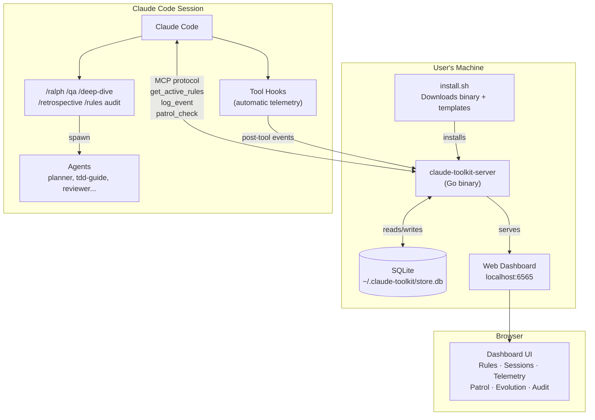
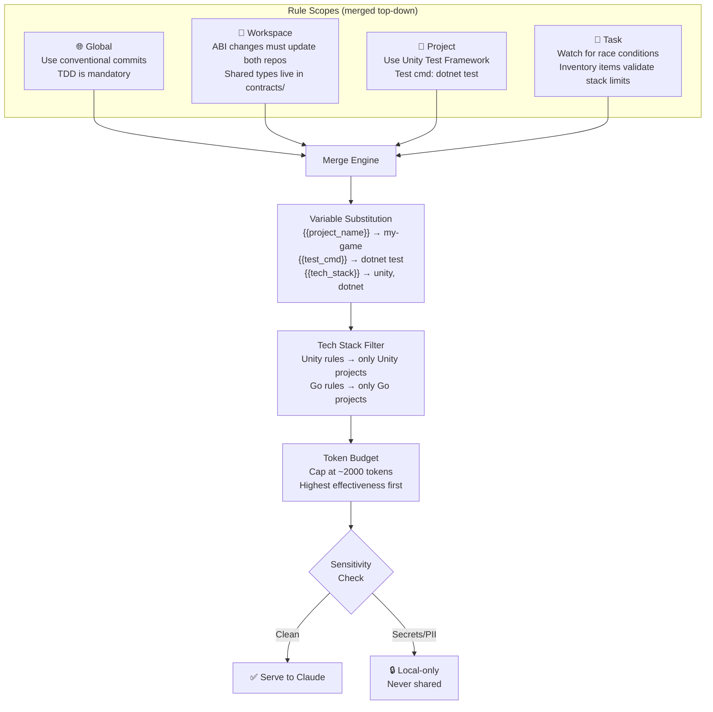
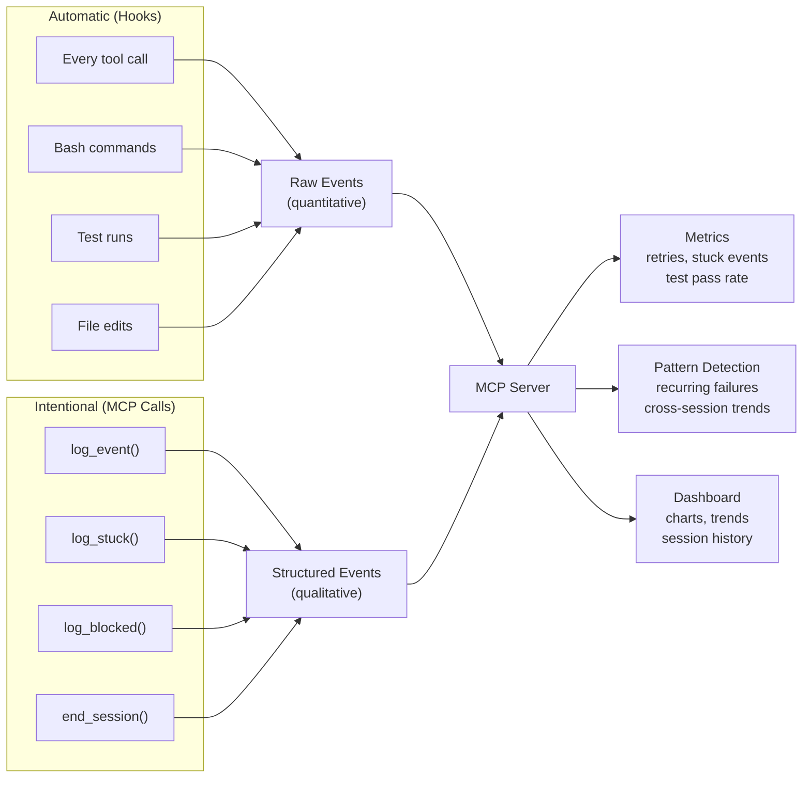
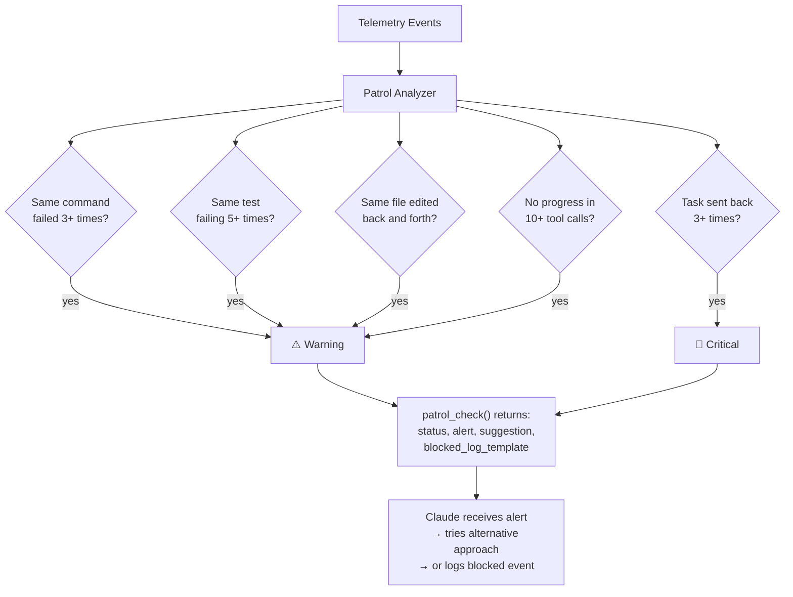
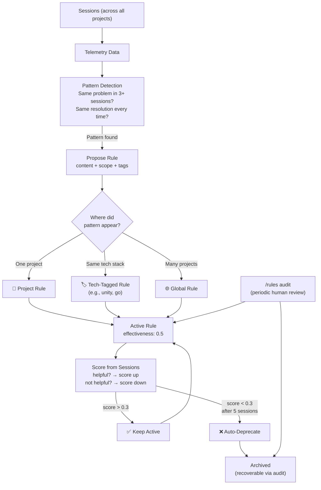
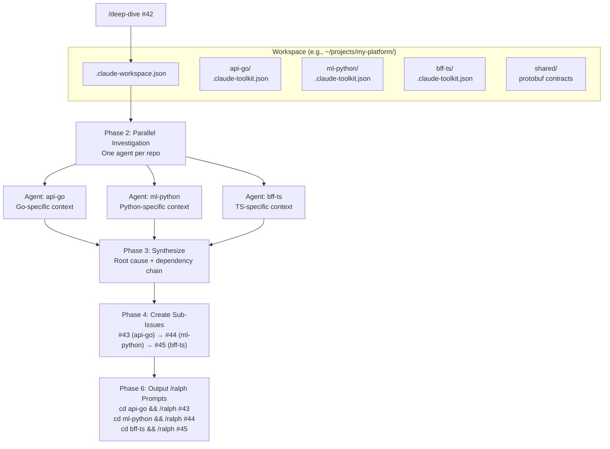

# Claude Code Toolkit

Autonomous development tooling for [Claude Code](https://docs.anthropic.com/en/docs/claude-code). Installs specialized agents, interactive skills, and rules into any project with one command.

## Quick Start

```bash
# Install toolkit
git clone https://github.com/bis-code/claude-toolkit.git ~/.claude/toolkit

# Install into your project
cd ~/your-project
~/.claude/toolkit/install.sh
```

Or one-liner:
```bash
curl -fsSL https://raw.githubusercontent.com/bis-code/claude-toolkit/main/install.sh | bash
```

## What You Get

### /ralph — Autonomous Feature Builder

Builds features from GitHub issues using an interactive orchestrator with subagent delegation and approval gates.

```bash
# In Claude Code:
/ralph --issues 42,43     # Build from specific issues
/ralph --label feature    # Build from labeled issues
/ralph --auto             # Auto-approve gates (CI mode)
```

**How it works:**
1. `/ralph` fetches GitHub issues and generates a `prd.json` with user stories
2. For each story: Explore → Plan → **Approval Gate** → Implement (TDD) → Review → **Approval Gate** → Commit
3. Specialized subagents handle each phase (planner, tdd-guide, code-reviewer, security-reviewer)
4. Domain agents spawned when story labels match installed agents (e.g., blockchain verification)
5. Final QA pass runs the full test suite before completion

### /qa — Three-Phase QA Orchestrator

Scans, triages, and fixes quality issues using parallel subagents with interactive approval.

```bash
# In Claude Code:
/qa                       # Full scan with interactive triage
/qa --scope api           # Backend only
/qa --scan-only           # Report only, no fixes
/qa --auto                # Auto-fix critical+high, issue medium, skip low
/qa --focus "auth"        # Boost severity of auth-related findings
```

**How it works:**
1. **Phase 1 — Scan**: Launches 7+ specialized agents in parallel (code-reviewer, security-reviewer, refactor-cleaner, etc.)
2. **Phase 2 — Triage**: Merges findings into a severity-ranked table. User picks what to fix, issue, or skip.
3. **Phase 3 — Fix**: Spawns targeted agents for each approved fix. Each fix: apply → test → commit individually.

## What Gets Installed

### In your project

| Path | Count | Purpose |
|------|-------|---------|
| `.claude/skills/*/SKILL.md` | 12 | User-facing slash commands (see [Skills](#skills)) |
| `.claude/agents/*.md` | 10+ | Generic + domain-specific agents (see [Agents](#agents)) |
| `.claude/rules/common/*.md` | 6 | Universal rules: testing, security, git, coding style, performance, search |
| `.claude/rules/<lang>/*.md` | varies | Language-specific rules (auto-detected) |
| `.claude/hooks/hooks.json` | 1 | PreToolUse and PostToolUse hooks |
| `tools/ralph/prd.json.example` | 1 | PRD format reference |
| `.claude-toolkit.json` | 1 | Project config (test commands, QA categories) |
| `.mcp.json` | 1 | MCP server config (merged, not overwritten) |
| `.deep-think.json` | 1 | Reasoning strategies |

### Globally (~/.claude/)

| Path | Count | Purpose |
|------|-------|---------|
| `commands/*.md` | 10 | Global slash commands (verify, search, ship-day, etc.) |

## Agents

Agents are specialized subprocesses spawned via the Task tool. They run as isolated subagents with their own system prompt and cannot see the parent session's context.

### Generic agents (always installed)

| Agent | Role |
|-------|------|
| `code-reviewer` | Code quality review — diffs, correctness, coverage gaps |
| `security-reviewer` | OWASP-focused vulnerability and auth bypass detection |
| `architect-reviewer` | Module boundaries, coupling analysis, dependency direction |
| `performance-reviewer` | N+1 queries, unbounded results, blocking operations |
| `planner` | Implementation planning with test strategy and parallel decomposition |
| `tdd-guide` | TDD enforcement with red-green-refactor and test skeleton generation |
| `build-error-resolver` | Build error diagnosis and minimal targeted fixes |
| `doc-updater` | Documentation maintenance after code changes |
| `refactor-cleaner` | Dead code removal, duplication consolidation |
| `incident-debugger` | Structured hypothesis-driven debugging |

### Domain agents (auto-detected)

Installed based on detected tech stack. Examples: `go-backend-architect`, `smart-contract-reviewer`, `prompt-engineer`, `cloud-architect`, `react-developer`.

Available domains: ai, blockchain, database, docker, dotnet, golang, graphql, kubernetes, observability, react, saas, unity.

## Skills

Skills are user-facing slash commands defined in `.claude/skills/*/SKILL.md`. Each skill orchestrates one or more agents to complete a workflow.

| Skill | Command | Description |
|-------|---------|-------------|
| ralph | `/ralph` | Autonomous feature builder from GitHub issues |
| qa | `/qa` | Three-phase QA orchestrator (scan, triage, fix) |
| plan | `/plan` | Implementation planning with subagent delegation |
| code-review | `/code-review` | Code quality review with diff analysis |
| security-review | `/security-review` | Security-focused review |
| architect-review | `/architect-review` | Architecture and coupling review |
| performance-review | `/performance-review` | Performance analysis |
| tdd-workflow | `/tdd-workflow` | Guided TDD session |
| build-fix | `/build-fix` | Diagnose and fix build errors |
| docs | `/docs` | Update documentation after changes |
| refactor-clean | `/refactor-clean` | Dead code and duplication cleanup |
| incident-debug | `/incident-debug` | Structured debugging workflow |

## Rules Architecture

Every `.md` file under `.claude/rules/` is injected into the system prompt for **every session and subagent**. This makes rules powerful but expensive — each line costs tokens on every interaction.

### Three Tiers

| Tier | Path | Installed By | Contents |
|------|------|-------------|----------|
| **Common** | `.claude/rules/common/` | Toolkit | Universal principles: testing, security, git, coding style, performance, search strategy |
| **Language** | `.claude/rules/<lang>/` | Toolkit (auto-detected) | Framework-specific patterns: Go error handling, React hooks, Rust ownership, etc. |
| **Project** | `.claude/rules/` (root) | You | Project-specific constraints, conventions, and overrides |

Common rules are installed for all projects. Language rules are added based on detected tech stack (e.g., a Go project gets `golang/` rules automatically).

### Token Budget Guidelines

- **~50 lines per rule file** — enough for principles, too short for tutorials
- **Principles and constraints belong in rules** — "always validate input at API boundaries"
- **Tutorials, examples, and API reference do NOT** — put these in regular files that agents can `Read` on demand
- **If a rule file exceeds 60 lines**, consider splitting it or moving reference material out

### Adding Project-Specific Rules

Create `.md` files directly in `.claude/rules/` for your project:

```
.claude/rules/
├── common/              # Toolkit-managed (don't edit)
├── golang/              # Toolkit-managed (don't edit)
└── my-project-rules.md  # Your rules (project-specific)
```

Keep project rules focused on what's unique to your codebase — naming conventions, architectural boundaries, deployment constraints. The common and language rules already cover general best practices.

## MCP Servers

| Server | Tier | Purpose |
|--------|------|---------|
| `deep-think` | **Required** | Structured reasoning with strategies and reflection |
| `playwright` | Recommended | Browser testing (auto-suggested for UI projects) |
| `leann-server` | Optional | Semantic code search |

## Project Configuration

The installer generates `.claude-toolkit.json` with your project's settings:

```json
{
  "version": "1.0.0",
  "project": {
    "name": "my-project",
    "type": "repository",
    "techStack": ["go", "react"]
  },
  "commands": {
    "test": "make test",
    "lint": "make lint"
  },
  "qa": {
    "scanCategories": ["tests", "lint", "missing-tests", "todo-audit"],
    "maxFixLines": 30
  }
}
```

Edit this file to customize QA behavior for your project.

### Project Types

| Type | When | Behavior |
|------|------|----------|
| `repository` | Git repo detected | Full git integration (branches, commits, PRs) |
| `workspace` | No git repo | Runs in-place, skips .gitignore |

## Non-Git Workspaces

The toolkit works in directories that aren't git repos (e.g., `~/work/coding/` with multiple sub-projects).

```bash
cd ~/work/coding
~/.claude/toolkit/install.sh
```

**What's different in workspace mode:**
- `.claude-toolkit.json` has `"type": "workspace"`
- `.gitignore` modifications are skipped
- Tech stack detection scans the directory as-is

## Auto-Detection

The toolkit auto-detects your tech stack and suggests appropriate settings:

| Detected | Test Command | Lint Command | QA Categories |
|----------|-------------|-------------|---------------|
| Go | `go test ./...` | `golangci-lint run` | + module-boundaries, security |
| Node.js | `npm test` | `npm run lint` | + accessibility, browser-testing |
| .NET/C# | `dotnet test` | `dotnet format` | + module-boundaries, security |
| Python | `pytest` | `ruff check .` | + module-boundaries, security |
| Rust | `cargo test` | `cargo clippy` | + module-boundaries, security |
| Solidity | `npx hardhat test` | `npx solhint` | + smart-contract-security, gas |
| React/Vue | (from package.json) | (from package.json) | + accessibility, component-quality |

Makefile targets are preferred over raw commands when available.

## Prerequisites

- [Claude Code](https://docs.anthropic.com/en/docs/claude-code) CLI installed and authenticated
- [jq](https://jqlang.github.io/jq/) — `brew install jq`
- [git](https://git-scm.com/)
- [gh](https://cli.github.com/) — GitHub CLI (optional, for issue fetching)
- [npm](https://nodejs.org/) — for MCP server installation

## Updating

```bash
cd ~/.claude/toolkit && git pull
~/.claude/toolkit/install.sh --update
```

## How It Works

The toolkit has three layers:

- **Skills** are user-facing slash commands (e.g., `/ralph`, `/qa`). They run in the user's session and orchestrate the workflow.
- **Agents** are specialized subprocesses spawned by skills via the Task tool. Each agent has its own system prompt and runs in isolation.
- **Rules** are `.md` files injected into the system prompt for every session and subagent. They enforce coding standards, security practices, and project conventions.

Complex skills like `/ralph` and `/qa` orchestrate multiple agents with approval gates and state management. Simpler skills (e.g., `/code-review`, `/plan`, `/build-fix`) spawn a single paired agent, collect results, and present them to the user.

## V4: Self-Evolving Orchestrator

V4 transforms the toolkit from a static rule installer into a **self-evolving development orchestrator**. A Go-based MCP server becomes the brain — managing dynamic rules, session telemetry, health patrol, and a web dashboard. The toolkit learns from every session and gets smarter over time.

### System Overview



### Rule Engine: 4-Scope Merging

Rules are dynamic, scoped, and served only when relevant. The server merges 4 scopes at query time, substitutes variables, and respects a token budget.



### Telemetry Pipeline

Dual-layer telemetry captures both raw events (automatic via hooks) and structured insights (intentional via MCP calls).



### Patrol: Health Monitoring

The patrol system analyzes telemetry in real-time to detect stuck loops, test spirals, and thrashing. Claude calls `patrol_check()` periodically.



### Self-Evolution Loop

The toolkit continuously learns from sessions. Patterns auto-promote to rules. Low-performing rules auto-deprecate.



### Cross-Repo Workspace

`/deep-dive` orchestrates investigation and planning across multiple repos in a workspace. Auto-detects repos or reads `.claude-workspace.json`.



## License

MIT
