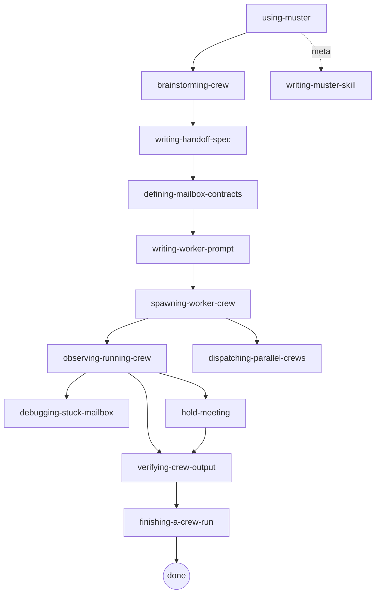

# muster — design spec

**Date:** 2026-04-07
**Status:** draft, awaiting user sign-off
**Author:** Claude (under brainstorming protocol) + bis-code
**Predecessor:** claude-toolkit (discontinued)
**Next step:** implementation via `/ralph-loop:ralph-loop`, one loop per phase

---

## 1. Identity

**Name:** `muster`

**Tagline:** *call up the agents, ship the work.*

**Elevator sentence:**
> muster is a headless-first multi-agent harness for Claude Code. A Go orchestrator spawns Claude subagents as workers, and they coordinate through JSONL mailbox files on disk — the same pattern the leaked Claude Code source shows Anthropic uses internally.

**Personality principles:**

| muster is | muster rejects |
|---|---|
| Debuggable with `cat`, `tail`, `jq` | Dashboards as primary interface |
| Flat coordinator/worker, one level | Hierarchical trees of agents |
| Files as the source of truth | In-memory brokers, SQL schemas |
| Opinionated defaults, few knobs | Configurable frameworks |
| Headless-first, in-session second | Slash-command-only tools |
| Superpowers-style skill discipline | Documentation-only rules |
| ~1200 LOC of Go you can read in an afternoon | 50k+ LOC framework |

---

## 2. Goals and non-goals

### Goals (v0)

1. Spawn and coordinate a flat crew of 2–6 Claude workers from a single spec file, headless, in Go.
2. Let workers coordinate through JSONL mailbox files and a small blackboard on disk, with deterministic, tail-friendly semantics.
3. Support **structured multi-party meetings** between workers as a first-class primitive.
4. Ship a 13-skill library in the superpowers style (HARD-GATEs, checklists, rigid vs flexible) that governs every user-facing action.
5. Provide honest observability: `muster status`, `muster tail`, `muster inspect`, and an SSE event stream.
6. Ship an in-session slash-command launcher in v0.2, built as a thin wrapper over the headless binary.

### Non-goals (v0 — explicitly deferred)

- ❌ Live in-memory message broker (bbolt + goroutine mailboxes). Thread 4 designed it; it's the v2 upgrade path.
- ❌ Hierarchical agent trees. The Claude Code platform forbids this (subagents cannot spawn subagents).
- ❌ Cross-host / distributed runs. Local filesystem only.
- ❌ Web dashboard UI. SSE endpoint is the API; build a UI later if needed.
- ❌ Self-evolving rule engine. Rules live in skill markdown, not a database. (claude-toolkit V5's biggest mistake.)
- ❌ Telemetry scoring and auto-deprecation of rules.
- ❌ Patrol / health monitoring. Observability is `muster tail`; the human is the patroller.
- ❌ Real-time sub-second agent conversations. Turn-based only in v0.
- ❌ Nested meetings or meetings that span multiple `muster run` invocations.
- ❌ More than one meeting per agent at a time.

---

## 3. Architecture overview

### The single defining diagram

```
┌─────────────────────────────────────────────────────────────────────┐
│                  muster (Go binary, long-lived per run)              │
│                                                                      │
│  ┌──────────────┐   ┌──────────────┐   ┌────────────────────────┐  │
│  │ Orchestrator │   │  Mailbox MCP │   │ Observability HTTP/SSE │  │
│  │    runner    │──▶│  (in-proc    │   │  GET /events           │  │
│  │              │   │   via Agent  │   │  tail: mailboxes,      │  │
│  │ spawn/route  │   │   SDK)       │   │        transcripts     │  │
│  └──────┬───────┘   └──────┬───────┘   └────────────────────────┘  │
│         │                  │                                        │
│         │           ┌──────▼─────────────────────────────┐          │
│         │           │  fsnotify watcher + cursor tracker │          │
│         │           │  + 100ms polling backstop (macOS)  │          │
│         │           └──────┬─────────────────────────────┘          │
│         │                  │                                        │
└─────────┼──────────────────┼────────────────────────────────────────┘
          │                  │
          │ Agent SDK         │ MCP tools:
          │ spawn             │  mailbox_send / mailbox_read
          │                  │  mailbox_wait / task_claim
          │                  │  blackboard_put / blackboard_get
          │                  │  roster
          │                  │  meeting_open / meeting_close
          │                  │  meeting_speak / meeting_transcript
          │                  │  meeting_state / meeting_adjourn
          ▼                  ▼
┌────────────────────────────────────────────┐
│    Claude Code subagents (workers)          │
│    planner · implementer · reviewer · ...   │
│    (each in isolated worktree)              │
└────────────────────────────────────────────┘
          │
          ▼
┌─────────────────────────────────────────────┐
│   .muster/runs/<run-id>/                     │
│   ├── manifest.json                          │
│   ├── mailboxes/                             │
│   │   ├── planner-01.jsonl                   │
│   │   ├── implementer-01.jsonl               │
│   │   └── reviewer-01.jsonl                  │
│   ├── blackboard/                            │
│   │   ├── plan.v1.json                       │
│   │   └── review.verdict.json                │
│   ├── tasks/queue.jsonl                      │
│   ├── meetings/<meeting-id>/                 │
│   │   ├── spec.json                          │
│   │   ├── transcript.jsonl                   │
│   │   ├── state.json                         │
│   │   └── decision.json                      │
│   ├── transcripts/agent-<id>.jsonl           │
│   └── debug/<ts>-*.{json,md}                 │
└─────────────────────────────────────────────┘
```

### The six load-bearing decisions

1. **Headless-first (shell order D).** Primary launcher is `muster run <spec>` invoking the Claude Agent SDK programmatically. Rationale: every multi-agent Claude Code project that survived to v2+ (ccswarm, claude_code_agent_farm, multiclaude, praktor, overstory) shipped headless-first; projects that went in-session-first (claude-mpm) are publicly paying the rewrite tax. Headless forces every hidden coupling to surface. Slash-command shell (`/muster:*`) ships in v0.2 as a thin wrapper — mailbox MCP and skill library port unchanged.

2. **Flat coordinator/worker, one level deep.** Hard constraint from Claude Code: *subagents cannot spawn subagents*. Hierarchical trees are forbidden at the platform level. Moderator in meetings is a **role attribute**, not a sub-coordinator.

3. **Files are the bus.** JSONL mailbox files on disk, one per agent. Append = send. Tail + cursor = receive. fsnotify = `mailbox_wait`. This matches exactly what the leaked Claude Code source shows Anthropic themselves use (wavespeed: *"workers can't independently approve high-risk actions. Instead, they send a request to the coordinator's mailbox"*; learn-claude-code: *"Multiple teammates coordinate via persistent async mailboxes using JSONL format"*).
   **fsnotify latency verdict:** 0.7% of a 300-second meeting budget; the Go broker would save 0.05% and is explicitly not worth the complexity tax in v0. Preserved as the v2 upgrade path.
   **macOS guardrail:** FSEvents can coalesce rapid-fire writes with up to ~500ms debounce. Coordinator runs a 100ms polling ticker as a backstop in addition to fsnotify.

4. **In-process MCP via the Agent SDK.** muster registers mailbox tools via `createSdkMcpServer()` — no subprocess, no socket. Worker tool calls become ordinary Go function calls. Identity is enforced at the SDK boundary using the `canUseTool` permission callback + per-worker token minted at spawn.

5. **Superpowers-style skill library (13 skills).** Every rigid skill has an Iron Law / HARD-GATE, a checklist that becomes TodoWrite tasks, a Red Flags table, and an explicit trigger phrase. Skills live in `muster/skills/` and ship with the binary.

6. **Meetings are first-class, coordinator-driven, round-based.** One speaker per round. The moderator is a Go state machine in the orchestrator by default, with optional LLM-moderator for spec-declared topic picking. Economic cost is linear in rounds, not rounds × participants, because only the active speaker is spawned per round. Everything is a tail-friendly file on disk.

### ~1200 LOC Go budget breakdown

| Component | LOC | What it does |
|---|---|---|
| Orchestrator runner | ~300 | Parses spec, spawns coordinator + workers via Agent SDK, writes manifest, owns run lifecycle |
| Mailbox MCP (in-proc) | ~250 | `mailbox_send/read/wait`, `task_claim`, `blackboard_put/get`, `roster` — all file-backed |
| Meetings package | ~200 | `meeting_open/close/adjourn/speak/transcript/state`, round loop, turn tokens |
| fsnotify + cursor | ~100 | File watcher, per-agent read cursors, wake parked `mailbox_wait` callers, 100ms macOS backstop |
| Observability HTTP/SSE | ~150 | `GET /events` streams every envelope + transcript append as JSON lines |
| Identity + permissions | ~100 | `canUseTool` callback, per-worker token, SubagentStart hook writer |
| CLI wiring | ~100 | `run / status / tail / inspect / finish / meeting / version` |

Target: **~1200 LOC of Go you can read in an afternoon.**

---

## 4. Components

### 4.1 Orchestrator runner (Go, `cmd/muster` + `internal/orchestrator/`)

Responsibilities:
- Parse `<spec.md>` into a typed `CrewSpec`
- Create `.muster/runs/<run-id>/` and write `manifest.json`
- Provision worktrees per worker
- Spawn workers via Claude Agent SDK (headless), one coordinator + N workers
- Own the lifecycle: track PIDs, collect SubagentStop events, transition manifest status `active → finished | failed | discarded`
- Terminate cleanly on signals, writing a terminal status to the manifest

### 4.2 Mailbox MCP (Go, `internal/mailbox/`)

Exposed via `createSdkMcpServer()` — in-process, no subprocess.

**Tools:**

| Tool | Purpose |
|---|---|
| `mailbox_send(to, subject, body)` | Addressed send; O_APPEND to recipient's JSONL |
| `mailbox_read(limit?, since?)` | Pull from own inbox since cursor |
| `mailbox_wait(timeout_ms, topics?, from?)` | Blocking wait backed by fsnotify + channel wake |
| `task_claim(queue)` | Work-stealing: atomic rename from queue to claimed file |
| `blackboard_put(key, value, ttl?)` | Write shared artifact |
| `blackboard_get(key\|prefix)` | Read shared artifact |
| `roster()` | List live agents in this run |

**Identity is enforced at the MCP boundary.** The SDK's `canUseTool` callback resolves the calling worker by its per-spawn token and stamps every outbound envelope with the verified `from` field. Workers cannot spoof identity — any `from` in tool arguments is overwritten.

### 4.3 Meetings package (Go, `internal/meetings/`)

Exposed via the same in-process MCP.

**Tools:**

```go
MeetingOpen(ctx, MeetingSpec) (MeetingID, error)
MeetingClose(ctx, MeetingID, Decision) error
MeetingAdjourn(ctx, MeetingID, Reason) error  // forced shutdown

MeetingSpeak(ctx, MeetingID, TurnToken, Text, []Attachment) error
MeetingTranscript(ctx, MeetingID, FromRound int) ([]Turn, error)
MeetingState(ctx, MeetingID) (State, error)
```

**`TurnToken`** is a one-shot capability the orchestrator embeds in the spawn prompt of the designated speaker. It prevents a confused subagent from speaking out of turn or in another meeting. Anti-cheat by construction.

See **§7 Meeting primitive** for the full protocol.

### 4.4 fsnotify + cursor tracker

Per-agent read cursors stored in `.muster/runs/<id>/.cursors.json`. The watcher owns one goroutine per watched file plus a 100ms ticker backstop for macOS FSEvents coalescing.

`mailbox_wait` core pattern:

```go
func (m *Mailbox) Wait(ctx context.Context, timeout time.Duration) []Envelope {
    if msgs := m.drain(); len(msgs) > 0 { return msgs }
    wakeup := make(chan struct{}, 1)
    m.park(wakeup)
    defer m.unpark(wakeup)
    select {
    case <-wakeup:             return m.drain()
    case <-time.After(timeout): return nil
    case <-ctx.Done():         return nil
    }
}
```

The watcher's fsnotify callback and the 100ms ticker both fan `wakeup <- struct{}{}` to parked waiters.

### 4.5 Observability HTTP/SSE

`GET /events` streams every envelope, transcript append, and manifest transition as JSON lines. Clients filter server-side with query params (`?run=<id>&kind=envelope,meeting`).

This is the integration point for any future dashboard UI. No UI in v0 — `curl | jq` is the dashboard.

### 4.6 Identity + permissions

**SubagentStart hook** (project-scoped, not plugin-shipped since plugin agents can't ship hooks):

1. Generates a deterministic `agent_id`
2. Mints a one-shot token
3. Persists `{agent_id, role, parent, token_hash}` to the orchestrator via an internal call
4. Injects `additionalContext` into the subagent:
   > You are `<agent_id>` in run `<run-id>`. Your role is `<role>`. Your peers are `[...]`. Use the `mailbox_*` tools to coordinate. Before ending any turn, call `mailbox_read` to drain your inbox. For structured multi-party discussion, use `meeting_*` tools.

**`canUseTool` callback** in the Agent SDK gets every tool invocation. It:
- Resolves the calling worker's token → `agent_id`
- Stamps envelopes with verified `from`
- Applies per-role tool restrictions (e.g., explorer workers can't `mailbox_send` to the coordinator's outbox)
- Logs every gated decision to the SSE stream

### 4.7 Skill library (`muster/skills/`)

13 skills following the superpowers template extracted in the research phase. See **§8 Skill library** for the list and **`docs/superpowers/specs/2026-04-07-muster-skills/`** for the full SKILL.md content.

---

## 5. Data model

### 5.1 Mailbox envelope schema (v1 — forward-compatible with meetings)

**Critical:** this schema must ship in v1 to avoid a breaking rewrite when meetings arrive. Thread 2 flagged this as a hard requirement.

```json
{
  "id": "msg_01HX...",
  "ts": "2026-04-07T12:34:56.789Z",
  "from": "planner-01",
  "to": "implementer-01",
  "role": "participant",
  "meeting_id": null,
  "round": null,
  "turn_seq": null,
  "in_reply_to": null,
  "kind": "task.assign",
  "version": 1,
  "body": { /* schema-validated per kind */ }
}
```

**Field semantics:**

| Field | Required | Notes |
|---|---|---|
| `id` | yes | ULID, unique per message |
| `ts` | yes | ISO-8601 UTC with ms precision |
| `from` | yes | Verified at MCP boundary, never trusted from input |
| `to` | yes | Agent id, `"*"` (broadcast), or `"meeting:<id>"` |
| `role` | yes | `coordinator \| participant \| moderator` |
| `meeting_id` | optional | Non-null for meeting messages |
| `round` | optional | Meeting round counter |
| `turn_seq` | optional | Monotonic turn sequence within a meeting |
| `in_reply_to` | optional | `id` of message being replied to |
| `kind` | yes | Typed message discriminator, matches a JSON schema |
| `version` | yes | Schema version, bumped on breaking changes |
| `body` | yes | Payload, schema-validated per `kind` |

Point-to-point handoffs use `meeting_id: null, round: null, turn_seq: null`. Meetings populate all three. Same file format, same parser, same fsnotify loop.

**Schemas** live at `.muster/specs/<slug>/schemas/<kind>.schema.json`. Every schema MUST specify `additionalProperties: false`, a `version` literal, and a `kind` literal.

### 5.2 Manifest (`manifest.json`)

```json
{
  "run_id": "run_01HX...",
  "spec_path": ".muster/specs/refactor-auth/refactor-auth.md",
  "status": "active",
  "started_at": "2026-04-07T12:34:56.789Z",
  "finished_at": null,
  "roster": [
    {
      "agent_id": "coordinator-01",
      "role": "coordinator",
      "worktree": "/path/to/wt-coord",
      "pid": 12345,
      "status": "alive",
      "started_at": "..."
    }
  ],
  "meetings": [],
  "termination": {
    "condition": "blackboard.key 'result' is set AND all worker mailboxes drained"
  }
}
```

Status transitions: `active → finished | failed | discarded`. Only the orchestrator writes this file.

### 5.3 Blackboard keys

Shared artifacts at `.muster/runs/<id>/blackboard/<key>.json`. One writer per key by convention; enforced via `canUseTool` role restrictions.

### 5.4 Task queue

`.muster/runs/<id>/tasks/queue.jsonl` for self-claiming work-stealing. `task_claim` uses atomic rename from `queue.jsonl` to `claimed/<agent-id>.jsonl`.

---

## 6. Run lifecycle

```
                     ┌─────────────────┐
                     │ muster run      │
                     │ <spec.md>       │
                     └────────┬────────┘
                              ▼
                     ┌─────────────────┐
                     │ Preflight:      │
                     │  git clean      │
                     │  contracts green│
                     │  no active run  │
                     │  spec committed │
                     └────────┬────────┘
                              ▼
                     ┌─────────────────┐
                     │ Write manifest  │
                     │ Provision       │
                     │ worktrees       │
                     └────────┬────────┘
                              ▼
                     ┌─────────────────┐
                     │ Spawn coord +   │
                     │ workers via     │
                     │ Agent SDK       │
                     └────────┬────────┘
                              ▼
                     ┌─────────────────┐        ┌──────────────┐
                     │ active: workers │◀──────▶│ muster       │
                     │ exchange msgs,  │        │ status/tail/ │
                     │ hold meetings   │        │ inspect      │
                     └────────┬────────┘        └──────────────┘
                              ▼
                     ┌─────────────────┐
                     │ Termination     │
                     │ condition met?  │
                     └────────┬────────┘
                              ▼
                     ┌─────────────────┐
                     │ muster:verifying│
                     │ -crew-output    │
                     └────────┬────────┘
                              ▼
                     ┌─────────────────┐
                     │ muster:finishing│
                     │ -a-crew-run     │
                     │  A integrate    │
                     │  B open PR      │
                     │  C archive      │
                     │  D discard      │
                     └─────────────────┘
```

See skills §8.5 (`spawning-worker-crew`), §8.6 (`observing-running-crew`), §8.8 (`verifying-crew-output`), §8.9 (`finishing-a-crew-run`).

---

## 7. Meeting primitive

### 7.1 One-sentence definition

> A muster meeting is a coordinator-driven, round-based conversation in which the orchestrator spawns **one participant per round**, feeds it the running transcript on disk, captures its single reply, and persists both a transcript and a schema-validated decision artifact.

### 7.2 Protocol: round-based coordinator loop

Chosen over (b) shared-file polling and (c) long-lived `claude -p` per participant because:
- (b) violates the "subagents return one final message" constraint — dormant agents can't poll
- (c) breaks headless reproducibility and doubles the spawn budget
- (a) is the only model that fits the platform constraints exactly

**The moderator is a Go state machine by default.** Optional LLM-moderator for speaker selection when declared in the spec. Routine turn-taking uses a deterministic strategy (`round_robin`, `moderator`, or `priority`) — never free-for-all (the platform forces this regardless).

### 7.3 The key economic insight

**One speaker per round, not N × rounds.** A 10-round, 4-participant meeting = **10 spawns**. Dormant participants don't exist between turns — they get reconstituted next time their slot comes up, with the full transcript as context. The platform constraint ("subagents return one final message") *is* the cheap design.

### 7.4 Termination precedence

1. `MeetingAdjourn` called explicitly (operator or moderator) → wins immediately
2. Validated `decision.json` produced by the closer
3. `MaxRounds` reached
4. `MeetingDeadline` wall clock exceeded

**A closer always runs at the end**, even on timeout. There is always a `decision.json`, possibly with `status: "inconclusive"`.

**Defaults:** `MaxRounds=8`, `TurnTimeout=120s`, `MeetingDeadline=15min`.

### 7.5 File layout

```
.muster/runs/<run-id>/meetings/<meeting-id>/
├── spec.json              # topic, participants, rules, decision_shape
├── transcript.jsonl       # append-only: {round, speaker, role, ts, text, attach}
├── state.json             # {status, round, next_speaker, started_at, last_turn_at}
├── decision.json          # written once by the closer; schema-validated
├── attachments/           # files participants share
└── log/
    ├── moderator.log
    └── turn-<n>-<speaker>.log
```

Debuggable with:
```bash
tail -f .muster/runs/abc/meetings/m1/transcript.jsonl | jq -r '"\(.speaker): \(.text)"'
```

### 7.6 Hard caps (v0)

- Participants ≤ 6
- `MaxRounds` ≤ 20
- `TurnTimeout` ≤ 5 min
- An agent cannot be in two meetings simultaneously (orchestrator holds `map[agentName]meetingID` lock)
- No nesting (platform constraint)
- No resume across `muster run` invocations

### 7.7 Failure handling

| Failure | Handling |
|---|---|
| Participant crashes (SDK error) | Retry once with same prompt; on second failure, write turn `{status: "failed", error}` and skip to next speaker. Meeting continues. |
| Participant > TurnTimeout | Orchestrator kills the spawn, records `{status: "timeout"}` turn, advances. |
| Moderator wedged | Same timeout policy. If the closing moderator fails twice, orchestrator writes the inconclusive decision itself. |
| Conflicting decisions | Impossible by construction — only one closer runs, only one `decision.json` is written. |
| Corrupted `transcript.jsonl` | On open, orchestrator truncates at the first malformed line, logs the truncation. Append-only design means corruption can only ever lose tail data. |
| Orchestrator restart | `state.json` + `transcript.jsonl` are sufficient to resume. |

### 7.8 Integration surfaces

Meetings are a library + CLI + run phase + skill:
- **Go library** (`internal/meetings`) used by everything else
- **CLI:** `muster meeting open --spec spec.yaml`, `muster meeting tail <id>`, `muster meeting close <id>`
- **Phase inside `muster run`:** a run plan can declare `phases: [{type: meeting, spec: ...}]`; the runner blocks on the meeting and feeds `decision.json` into the blackboard for downstream phases
- **Skill** `muster:hold-meeting` (see §8.13)

### 7.9 v2 upgrade path (if real-time becomes required)

- Swap spawn model → long-lived `claude -p` PTY processes per participant; orchestrator becomes a multiplexer
- Add `meeting_listen` SSE tool for mid-turn push
- Move transcript storage to S3/GCS + Postgres advisory lock for distributed runs
- Speaker selection by learned policy (train a small classifier on past (transcript → next speaker) pairs)

The v0 file layout is forward-compatible with all of this. Nothing in v2 requires rewriting v0 meeting records.

---

## 8. Skill library (13 skills)

All skills follow the superpowers template: frontmatter (`name`, `description: "Use when..."`), Overview with bolded core principle, Iron Law + `<HARD-GATE>` for rigid skills, When to Use, 5–10 item Checklist, dot/mermaid Process Flow, concrete muster commands, Red Flags table, Rationalizations table, Integration section with sibling references, Quick Reference.

Full SKILL.md content lives in `docs/superpowers/specs/2026-04-07-muster-skills/`.

| # | Skill | Type | HARD-GATE | One-line purpose |
|---|---|---|---|---|
| 1 | [`using-muster`](2026-04-07-muster-skills/using-muster.md) | rigid meta | no muster tool call without the governing skill loaded | Entry gate; priority ordering; skill discovery |
| 2 | [`brainstorming-crew`](2026-04-07-muster-skills/brainstorming-crew.md) | rigid | no handoff/spawn until user explicitly approves | 5-question dialog to design a crew |
| 3 | [`writing-handoff-spec`](2026-04-07-muster-skills/writing-handoff-spec.md) | rigid | no contract design until spec has zero TBDs | Commit a clean spec to `.muster/specs/` |
| 4 | [`defining-mailbox-contracts`](2026-04-07-muster-skills/defining-mailbox-contracts.md) | rigid | no spawn without green contract test for every edge | JSON Schema + contract tests |
| 5 | [`writing-worker-prompt`](2026-04-07-muster-skills/writing-worker-prompt.md) | rigid | no placeholders, no external refs in prompts | Self-contained worker prompts with inline schemas |
| 6 | [`spawning-worker-crew`](2026-04-07-muster-skills/spawning-worker-crew.md) | rigid | no spawn on dirty workspace or stale contracts | Preflight + launch crew |
| 7 | [`observing-running-crew`](2026-04-07-muster-skills/observing-running-crew.md) | flexible | — | Read-only status and wedge detection |
| 8 | [`debugging-stuck-mailbox`](2026-04-07-muster-skills/debugging-stuck-mailbox.md) | rigid | no fix without captured offending message | 4-phase root-cause investigation |
| 9 | [`verifying-crew-output`](2026-04-07-muster-skills/verifying-crew-output.md) | rigid | no "done" claim without fresh evidence per acceptance item | Evidence gate before finish |
| 10 | [`finishing-a-crew-run`](2026-04-07-muster-skills/finishing-a-crew-run.md) | rigid | no finish action without PASS verification | 4 terminal options: integrate / PR / archive / discard |
| 11 | [`dispatching-parallel-crews`](2026-04-07-muster-skills/dispatching-parallel-crews.md) | flexible | — | Isolation matrix + multi-crew launch |
| 12 | [`writing-muster-skill`](2026-04-07-muster-skills/writing-muster-skill.md) | rigid meta | no skill commit without documented pressure test | TDD for skills via fresh-subagent violation attempts |
| 13 | [`hold-meeting`](2026-04-07-muster-skills/hold-meeting.md) | rigid | one meeting per decision; decision_shape before open | Open and run a structured multi-party meeting |

### Skill dependency graph



**Entry points:** `using-muster` (always), `brainstorming-crew` (new crew), `writing-muster-skill` (meta authoring).
**Terminal:** `finishing-a-crew-run`.
**Cross-cutting:** `debugging-stuck-mailbox`, `verifying-crew-output`, `hold-meeting`.

---

## 9. Implementation plan

### 9.1 Driven by `/ralph-loop:ralph-loop`, one loop per phase

Per research Thread 4 and the feedback memory (`feedback_no_loops.md`): **one ralph-loop per phase, one loop per session, razor-sharp scope**. No mega-loops.

Each loop uses **superpowers** skills inside each iteration:
- `superpowers:test-driven-development` for the test discipline
- `superpowers:subagent-driven-development` for parallel file work
- `superpowers:verification-before-completion` before emitting the completion promise

### 9.2 Phase breakdown

#### Phase 1 — Skeleton + `muster run`

Completion promise: `<promise>PHASE1_DONE</promise>`

- Go module at `./cmd/muster` and `./internal/{orchestrator,mailbox,worker,manifest}`
- Spec parser (markdown + frontmatter)
- `muster run <spec.md>` creates a run dir, writes manifest, spawns ONE coordinator worker via Claude Agent SDK
- `muster version`
- Tests covering: spec parsing, run-dir creation, manifest write, mailbox append, worker spawn (mocked SDK)
- Definition of done (mechanical gates):
  - `go build ./...` exits 0
  - `go test ./...` exits 0
  - `./muster run testdata/hello.md` produces `.muster/runs/<id>/coordinator.jsonl` with at least one line

#### Phase 2 — Mailbox primitives + worker spawn

Completion promise: `<promise>PHASE2_DONE</promise>`

- Full mailbox MCP tool set via `createSdkMcpServer`
- fsnotify watcher + cursor tracker + 100ms macOS backstop
- `canUseTool` identity enforcement with per-worker token
- SubagentStart hook (project-scoped) that mints identity
- `mailbox_wait` implementation with blocking select + timeout
- Blackboard put/get, roster, task_claim
- Multi-worker spawn from spec
- Tests: envelope round-trip, identity spoofing attempts blocked, `mailbox_wait` wakes on fsnotify, cursor survives restart
- Definition of done:
  - All Phase 1 gates still pass
  - New integration test: 3-worker hello-world crew where workers exchange messages via mailboxes, finishes in <60s
  - Contract tests pass for all envelope kinds

#### Phase 3 — `status` / `tail` / `inspect` / `finish` + meetings

Completion promise: `<promise>PHASE3_DONE</promise>`

- CLI subcommands: `muster status`, `muster tail <run-id>`, `muster inspect <agent-id>`, `muster finish <run-id> [--discard]`
- SSE observability endpoint (`GET /events`)
- Full meetings package:
  - `MeetingOpen / Close / Adjourn / Speak / Transcript / State`
  - Round-based coordinator loop (Go state machine)
  - Default `round_robin` + optional `moderator` / `priority` strategies
  - Turn tokens
  - Failure handling (timeout, retry, skip)
  - `decision.json` schema validation
- `muster meeting` CLI subcommand group
- Tests: meetings end-to-end with 4 participants × 5 rounds, adjourn mid-meeting, closer retry on failure
- Definition of done:
  - All previous gates pass
  - End-to-end test: spawn a 3-worker crew that opens a meeting, reaches a decision, and finishes via `muster finish`
  - SSE endpoint streams events for a full run without loss

#### Phase 4 — Skill library + docs + release prep

Completion promise: `<promise>PHASE4_DONE</promise>`

- Ship all 13 SKILL.md files under `muster/skills/`
- Each rigid skill passes its own pressure test via `muster:writing-muster-skill` methodology (test files under `muster/skills/tests/`)
- README.md with quickstart
- `muster init` subcommand to scaffold `.muster/` in a new project
- GoReleaser config for cross-platform binaries
- Definition of done:
  - All previous gates pass
  - Every rigid skill has a HONORED pressure-test file
  - `muster init && muster run testdata/hello.md` works on a clean clone
  - `go vet ./... && golangci-lint run` clean

### 9.3 Loop prompt template

```
/ralph-loop "Implement Phase <N> of muster per
docs/superpowers/specs/2026-04-07-muster-design.md.

Scope: <bullet list of phase deliverables>

Process:
1. Use superpowers:test-driven-development for every file. Red-green-refactor.
   No production code without a failing test first.
2. Use superpowers:subagent-driven-development to dispatch independent file
   groups to parallel subagents within this iteration.
3. After each subagent returns, run `go build ./... && go test ./...` and fix
   any failures before the next iteration.
4. Use superpowers:verification-before-completion before emitting the promise.

Definition of done for Phase <N>:
- <mechanical gate 1>
- <mechanical gate 2>
- <mechanical gate 3>
All gates must be verifiable in the same iteration.

When ALL gates pass in a single iteration, output exactly:
<promise>PHASE<N>_DONE</promise>

Do not emit the promise early. If stuck, note it in .muster/blockers.md
and keep iterating."
--max-iterations 30 --completion-promise "PHASE<N>_DONE"
```

### 9.4 Project layout target

```
muster/                              # new repo, github.com/bis-code/muster
├── cmd/
│   └── muster/
│       └── main.go                  # CLI entrypoint
├── internal/
│   ├── orchestrator/                # run lifecycle, spec parsing, spawn
│   ├── mailbox/                     # JSONL append, read, wait, cursor
│   ├── meetings/                    # round loop, turn tokens, decision
│   ├── manifest/                    # manifest.json read/write
│   ├── fsnotify/                    # watcher + 100ms backstop
│   ├── identity/                    # canUseTool callback, token mint
│   └── sse/                         # observability HTTP
├── skills/                          # 13 SKILL.md files shipped with binary
│   ├── using-muster/SKILL.md
│   └── ...
├── testdata/
│   └── hello.md                     # minimal spec used in Phase 1
├── docs/
│   ├── architecture.md              # references this design spec
│   └── skill-tests/                 # pressure-test outputs
├── .goreleaser.yaml
├── go.mod
├── README.md
└── LICENSE                          # MIT
```

---

## 10. Open questions (to revisit during implementation)

These are not blockers for starting Phase 1 but will need answers before they land:

1. **Go MCP SDK choice.** Default pick: `mark3labs/mcp-go` (supports stdio + Streamable HTTP + in-process). Alternative: the official `modelcontextprotocol/go-sdk` (stdio-focused). Revisit when Phase 2 starts if the official SDK has caught up on HTTP.

2. **Agent SDK — TypeScript or Python for the outer binary?** v0 baseline is Go calling Claude Agent SDK via child processes of `claude -p`. If the Python or TS Agent SDK exposes in-process spawning that beats subprocess overhead, revisit in Phase 2.

3. **Worker transcripts.** Keep copying subagent transcript JSONL into `.muster/runs/<id>/transcripts/`, or symlink to the Claude Code cache? Affects debuggability and disk usage.

4. **Default `permissionMode` for workers.** `acceptEdits` is ergonomic but unsafe for unattended runs. `bypassPermissions` is required for true headless CI. Decide per-phase default in Phase 2 once we run the first real crew.

5. **Spec file format.** Markdown with YAML frontmatter (current assumption) vs a stricter YAML/JSON schema. Markdown lets humans write specs fast; a typed schema lets tooling validate earlier. Reopen in Phase 1.

6. **Visual topology renderer.** Should `muster status` print an ASCII topology (workers + mailbox edges + meeting state)? Cheap win for debuggability, not a v0 blocker.

7. **In-session slash-command shell (v0.2).** The thin wrapper is simple in principle, but needs a design pass once headless is stable. How does a `/muster:run` slash command pass a spec file into the headless binary from within a Claude Code session? Probably via a Bash tool call, but worth spiking.

8. **Cross-project reuse of `.muster/runs/`.** A run-id is unique per project dir. Do we expose a `muster status --all-projects` view? Not v0.

---

## 11. Research provenance

This spec is the synthesis of seven parallel research subagents dispatched during brainstorming:

| Thread | Delivered | Impact |
|---|---|---|
| Claude Code primitives audit (v2.1.89) | Capability matrix; "subagents cannot spawn subagents" constraint | Shaped §3 decision #2 (flat topology) and §3 decision #4 (in-process MCP) |
| Harness engineering article + leak analysis | Direct quotes from wavespeed / learn-claude-code / humanlayer / dev.to on JSONL mailbox pattern and coordinator/worker flat topology | Shaped §3 decision #3 (files-as-bus) |
| Multi-agent framework prior art (Swarm/LangGraph/CrewAI/AutoGen/ADK/Mastra) | Parent-owned handoff workflow recommendation; "don't build infrastructure for coordination you haven't proven you need" | Overturned earlier Go-broker-with-`bus_wait` sketch |
| Go broker architecture | Full bbolt + mark3labs/mcp-go design with token-bound HTTP sessions | Preserved as §7.9 v2 upgrade path |
| Runtime shell (in-session vs headless) | Decision matrix; real-project evidence; D=19 vs C=13 vs B=18 vs A=9 | §3 decision #1 (headless-first) |
| Project naming + identity | Ranked 15 candidates; availability-checked top 5; winner `muster`, tagline "call up the agents, ship the work" | §1 |
| Superpowers skill deep-dive | Reverse-engineered 14-skill template; convention extraction; proposed 13 muster skills | §8 + all files in `2026-04-07-muster-skills/` |
| Meeting primitive design | Round-based coordinator loop; one-speaker-per-round economics; 6 new MCP tools; file layout; failure handling | §7 |
| Architecture validation under meetings requirement | KEEP verdict on all 4 decisions + fsnotify latency budget (0.7% of 300s) + macOS guardrail + envelope schema forward-compat | §3, §5.1 |
| ralph-loop integration | Confirmed ralph-loop is a ~190-line Stop hook; use for bootstrapping muster's own implementation, not as runtime target; one loop per phase | §9 |

---

## 12. Summary: what ships in v0

A single Go binary (`muster`) that:
- Spawns and coordinates a flat crew of 2–6 Claude workers from a spec file, headless
- Provides in-process MCP tools (`mailbox_*`, `blackboard_*`, `meeting_*`, `roster`) backed by JSONL files and fsnotify
- Supports first-class round-based meetings with schema-validated decisions
- Enforces identity via `canUseTool` + per-worker tokens
- Exposes an SSE observability stream
- Ships with 13 superpowers-style skills governing every user action

Total Go code: ~1200 LOC.
Total skill markdown: ~2400 lines across 13 files.
Implementation plan: 4 ralph-loop phases, 30 iterations each.
First ralph-loop command is ready to run the moment this spec is approved.

**Tagline reminder:** *muster — call up the agents, ship the work.*
