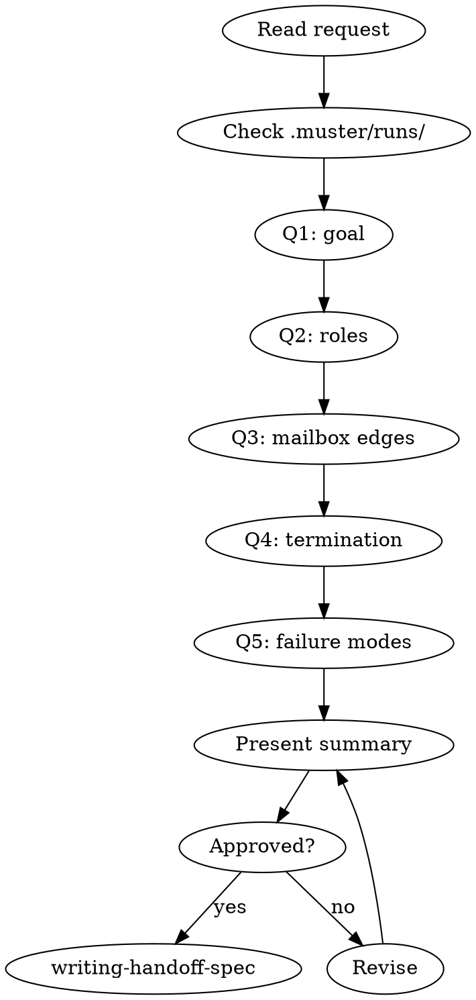

# Brainstorming a Muster Crew

## Overview

Muster crews fail when the spec is fuzzy. This skill forces a structured, question-at-a-time dialog that surfaces goals, roles, mailbox edges, termination conditions, and risks — before anything is written to disk.

**Core principle:** A crew is only as good as the design it started from. Spawn first, debug forever.

**Violating the letter of these rules is violating the spirit.**

## The Iron Law

```
NO HANDOFF SPEC, NO WORKER PROMPT, NO SPAWN UNTIL THE USER EXPLICITLY APPROVES THE BRAINSTORM SUMMARY
```

<HARD-GATE>
You MUST NOT invoke `muster:writing-handoff-spec`, `muster:writing-worker-prompt`, or `muster:spawning-worker-crew`, and you MUST NOT write any file under `.muster/` until the user has replied with explicit approval (e.g. "approved", "ship it", "yes go") to the brainstorm summary you presented. "Sounds good" on a single question is not approval of the whole design.
</HARD-GATE>

## When to Use

- User says "I want a crew that…", "spin up agents to…", "have muster do…"
- User describes work involving 2+ coordinated subagents
- User hands you a rough idea with no roles, no message shapes, no done-condition
- An existing crew is being re-designed from scratch

**Don't use when:** re-running an already-approved crew (jump to `muster:spawning-worker-crew`), or for single-agent work that doesn't need muster at all.

## Checklist

Create a TodoWrite task per item:

1. **Read the user's request** — identify verbs, nouns, acceptance signal
2. **Check project state** — `ls .muster/runs/` for prior crews; read `manifest.json` of any similar runs
3. **Ask the goal question** — one question, multiple choice when possible
4. **Ask the role question** — who are the workers, what does each own
5. **Ask the edges question** — which mailboxes exist, who writes, who reads
6. **Ask the termination question** — what signals "done", who decides
7. **Ask the failure question** — what does "wedged" look like, when do we abort
8. **Present the summary** — roles, edges, termination, failure modes, risks
9. **Wait for explicit approval** — do not proceed on ambiguous replies
10. **Invoke `muster:writing-handoff-spec`** — only after approval

## Process Flow



## The Questions

Ask ONE per message. Prefer multiple choice. Never batch.

**Q1 — Goal.** "What is the single measurable outcome this crew must produce? (a) an artifact on disk, (b) a passing test suite, (c) a PR, (d) other — describe."

**Q2 — Roles.** "Here are three role shapes I can see. Pick one or describe your own: (a) coordinator + N identical workers, (b) coordinator + specialists (A/B/C), (c) pipeline (worker-1 → worker-2 → worker-3)."

**Q3 — Mailbox edges.** For each role, ask: "Which mailboxes does it read, which does it write? Any blackboard keys it owns?"

**Q4 — Termination.** "Which of these declares the run done? (a) coordinator writes `done` to its own mailbox, (b) all workers exit, (c) a blackboard key `result` appears, (d) external signal via `muster finish`."

**Q5 — Failure modes.** "What wedge scenarios scare you most? (a) worker loops forever, (b) mailbox grows unbounded, (c) coordinator crashes mid-run, (d) workers disagree on a shared key."

## The Summary Format

Present exactly this structure, then wait:

```
## Crew Brainstorm Summary

**Goal:** <one sentence>
**Topology:** coordinator + <N> workers (<shape>)

**Roles:**
- coordinator — reads: [...], writes: [...], blackboard: [...]
- worker-a — reads: [...], writes: [...]
- worker-b — reads: [...], writes: [...]

**Termination:** <condition>
**Failure modes watched:** <list>
**Out of scope:** <list>

Reply "approved" to proceed to muster:writing-handoff-spec.
```

## Red Flags — STOP

| Thought | Reality |
|---|---|
| "The user said 'sounds good' so we're done" | That was one question. Get approval on the FULL summary |
| "I can infer the mailbox edges" | Inference is how wedges are born. Ask |
| "Three roles is obvious, skip Q2" | If it's obvious, confirming costs one message |
| "User is frustrated with questions" | Say so and offer to batch remaining Qs in a single structured form, still awaiting approval |
| "We can figure out termination during implementation" | Termination undefined = crew runs forever |
| "Let me write the handoff spec while I wait for their answer" | No. Writing the spec before approval wastes the revision |

## Common Rationalizations

| Excuse | Reality |
|---|---|
| "This is a toy crew, skip brainstorm" | Toy crews are where silent wedges hide |
| "I'll ask questions inline while spawning" | Spawning with TBDs is the #1 wedge cause |
| "User already described everything" | They described the goal. They did not describe mailbox edges |

## Integration

**Required sub-skills:** None — this is the entry point.
**Called by:** `muster:using-muster` when user describes new crew work.
**Pairs with:** `muster:writing-handoff-spec` (next step), `muster:dispatching-parallel-crews` (if multiple crews emerge).

## Quick Reference

```
5 questions, one at a time, multiple choice where possible:
  goal → roles → edges → termination → failures
Present structured summary.
Wait for "approved".
Hand off to muster:writing-handoff-spec.
```

No approval, no progress. Period.
