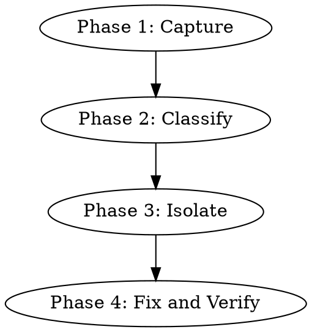

# Debugging a Stuck Mailbox

## Overview

Wedges in muster look alike: no progress, mailbox depth frozen or growing, workers idle. The cause is always one of four classes: schema mismatch, consumer crashed, producer blocked, or termination misdesign. This skill forces you to identify which class before touching anything.

**Core principle:** You cannot fix a wedge you haven't classified.

**Violating the letter of these rules is violating the spirit.**

## The Iron Law

```
NO FIX WITHOUT THE OFFENDING MESSAGE CAPTURED AND THE WEDGE CLASS NAMED
```

<HARD-GATE>
You MUST NOT edit a worker prompt, restart a worker, write to a mailbox, call `blackboard_put`, or invoke `muster finish` until you have: (1) captured the offending message or last-progress marker into a file under `.muster/runs/<run-id>/debug/<timestamp>.json`, (2) written the wedge class (schema / crashed-consumer / blocked-producer / termination) into that same debug note, (3) stated which contract test would have caught this. Paste the note path before any mutation.
</HARD-GATE>

## When to Use

- `muster:observing-running-crew` flagged a wedge heuristic
- A worker transcript has been silent >15 minutes
- Mailbox depth grows without bound
- User reports "it's stuck"

**Don't use when:** the run has cleanly finished (`muster:verifying-crew-output`), or you haven't even observed yet (`muster:observing-running-crew` first).

## The Four Phases



## Checklist

1. **Phase 1 — Capture** — snapshot the wedge state
2. **Phase 1 — Snapshot mailbox tail** — last 5 lines of the wedged mailbox
3. **Phase 1 — Snapshot transcripts** — last 50 lines of every worker transcript
4. **Phase 1 — Snapshot blackboard** — full dump of relevant keys
5. **Phase 2 — Classify** — pick exactly one of the four classes
6. **Phase 3 — Isolate** — re-run the relevant contract test against the captured message
7. **Phase 3 — Identify the offending side** — producer or consumer
8. **Phase 4 — Fix** — smallest intervention that addresses the root cause
9. **Phase 4 — Verify** — re-run contract tests, restart the affected worker, observe mailbox drains
10. **Phase 4 — Postmortem note** — append root cause and prevention to the debug file

## Phase 1 — Capture

```bash
RUN_ID=$(readlink .muster/runs/latest)
TS=$(date +%Y%m%dT%H%M%S)
DEBUG_DIR=.muster/runs/$RUN_ID/debug
mkdir -p $DEBUG_DIR

# Mailbox tail
tail -n 5 .muster/runs/$RUN_ID/mailboxes/<wedged>.jsonl > $DEBUG_DIR/$TS-mailbox.jsonl

# Transcripts
for t in .muster/runs/$RUN_ID/transcripts/*.jsonl; do
  tail -n 50 $t > $DEBUG_DIR/$TS-$(basename $t)
done

# Blackboard
cp -r .muster/runs/$RUN_ID/blackboard $DEBUG_DIR/$TS-blackboard

# Manifest
cp .muster/runs/$RUN_ID/manifest.json $DEBUG_DIR/$TS-manifest.json
```

Every subsequent step cites files in `$DEBUG_DIR`.

## Phase 2 — Classify

Pick ONE class. If you want to pick two, you haven't captured enough.

| Class | Signature |
|---|---|
| **schema** | Offending message exists, fails contract validation |
| **crashed-consumer** | Transcript ends with error/exit, no further lines, mailbox has unread entries |
| **blocked-producer** | Producer's transcript shows it's waiting on a blackboard key, downstream key, or another mailbox |
| **termination** | Everything runs but no one writes the `done` signal; coordinator never exits |

Write the class and evidence to `$DEBUG_DIR/$TS-classification.md`.

## Phase 3 — Isolate

- **schema:** run the contract test against the captured offending message. Expect a specific failing assertion. If the test passes, the schema is wrong, not the message.
- **crashed-consumer:** read the tail of its transcript; find the last tool call and its error. Reproduce locally if possible.
- **blocked-producer:** identify what it's waiting on. Is the upstream producer alive? Is the blackboard key actually written?
- **termination:** re-read the spec's Termination section. Does the written condition match what the coordinator actually checks in its prompt?

## Phase 4 — Fix & Verify

Smallest viable fix per class:

| Class | Fix |
|---|---|
| schema | Update producer's prompt and/or schema; bump version; re-run contract tests; re-spawn only the producer |
| crashed-consumer | Fix the underlying error; re-spawn the consumer; leave mailbox as-is so it reprocesses |
| blocked-producer | Unblock upstream; do not edit the blocked worker |
| termination | Update coordinator prompt; restart coordinator; verify new termination condition against the spec |

After any fix:

```bash
# Re-run contract tests
go test ./.muster/specs/<slug>/contracts/...

# Observe the mailbox for 2 minutes
watch -n 5 'wc -l .muster/runs/'$RUN_ID'/mailboxes/*.jsonl'
```

Append result to the debug note. Only then claim the wedge is cleared.

## Red Flags — STOP

| Thought | Reality |
|---|---|
| "It's probably a schema issue, let me just edit the schema" | Without captured evidence, you are guessing. 50% of wedges are crashed consumers |
| "Restart the whole crew from scratch" | You lose the wedge evidence and will reproduce the bug next run |
| "Delete the bad message and move on" | The bad message is the only proof of which class the wedge is. Copy it first |
| "The worker is probably just slow" | Prove it. Check the transcript's last timestamp against normal cadence |
| "I'll `muster finish` and try again" | That archives the evidence. Capture first |
| "Two classes look right" | Pick the upstream one. Downstream symptoms lie |

## Common Rationalizations

| Excuse | Reality |
|---|---|
| "Capture takes time" | Capture is 30 seconds, debugging without it is hours |
| "I remember what the mailbox looked like" | You don't. Compaction ate it |
| "Contract tests passed at spawn, can't be schema" | Workers drift. Re-run against the CAPTURED message |

## Integration

**Required sub-skills:** `muster:observing-running-crew` (must be run first to confirm the wedge).
**Called by:** `muster:observing-running-crew` on wedge heuristic trip.
**Pairs with:** `muster:defining-mailbox-contracts` (contract tests are the diagnostic), `muster:writing-worker-prompt` (prompt edits often land here).

## Quick Reference

```
Phase 1: capture → .muster/runs/<id>/debug/<ts>-*
Phase 2: classify → schema | crashed-consumer | blocked-producer | termination
Phase 3: isolate → run contract against captured msg / read transcript
Phase 4: smallest fix → re-run contracts → watch mailbox drain → postmortem note
```

No evidence, no fix. No exceptions.
