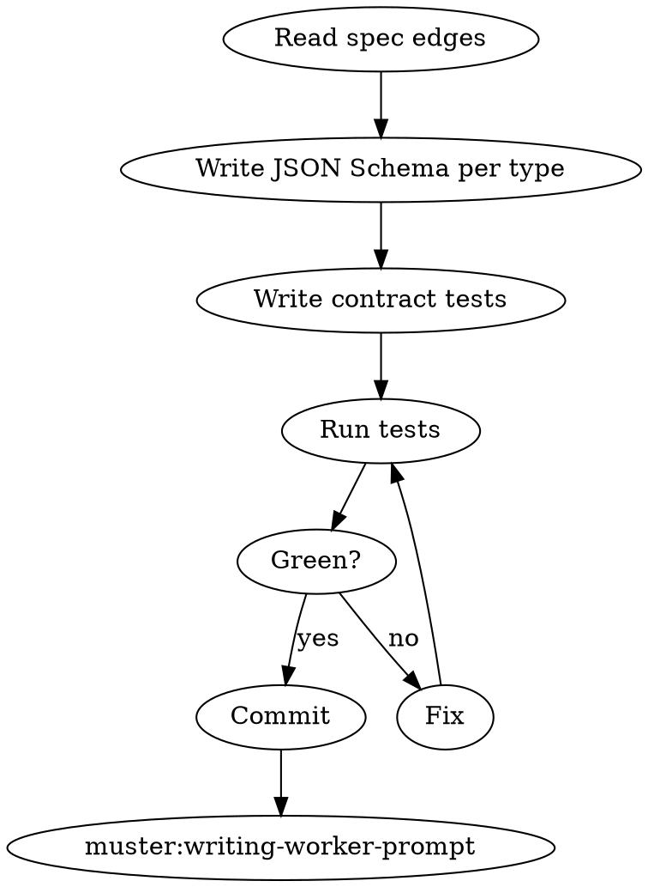

# Defining Mailbox Contracts

## Overview

Muster mailboxes are append-only JSONL at `.muster/runs/<run-id>/mailboxes/<agent>.jsonl`. Every line is a message. If producers and consumers disagree on shape, the reader hangs on `mailbox_wait` or crashes on parse. Contracts fix this by making the shape executable.

**Core principle:** Contracts are tests, not documentation. If they don't run, they don't exist.

**Violating the letter of these rules is violating the spirit.**

## The Iron Law

```
NO WORKER SPAWN WITHOUT A GREEN CONTRACT TEST FOR EVERY MAILBOX EDGE
```

<HARD-GATE>
You MUST NOT invoke `muster:writing-worker-prompt` or `muster:spawning-worker-crew` until every edge in the handoff spec has a JSON Schema file under `.muster/specs/<slug>/schemas/`, a contract test file under `.muster/specs/<slug>/contracts/`, and `go test ./.muster/specs/<slug>/contracts/...` (or equivalent) exits 0. Paste the green test output before proceeding.
</HARD-GATE>

## When to Use

- After `muster:writing-handoff-spec` commits a clean spec
- When an existing contract must change (treat as a new spec revision)
- When a debugging session reveals a schema mismatch and contracts must be retrofitted

**Don't use when:** the spec is still draft, or there are no mailbox edges (rare — reconsider the design).

## Checklist

1. **List every edge** from the spec's Mailbox Edges table
2. **Author JSON Schema** for each message type (draft 2020-12 or newer)
3. **Author a contract test** that constructs a valid and an invalid example per schema
4. **Author a round-trip test** — producer → `mailbox_send` → consumer `mailbox_read` → validate
5. **Run the contract test suite** locally
6. **Capture green output** — copy into your response, show zero failures
7. **Commit schemas and tests** — `test(muster): add contracts for <slug>`
8. **Hand off to `muster:writing-worker-prompt`**

## Process Flow



## Schema Layout

```
.muster/specs/<slug>/
  schemas/
    task-assign.schema.json
    task-result.schema.json
    run-config.schema.json
  contracts/
    task_assign_test.go
    task_result_test.go
    roundtrip_test.go
```

## Schema Requirements

Every schema MUST specify:

- `$schema` — draft version
- `$id` — stable identifier for cross-refs
- `type: object` at root
- `required` array listing mandatory fields
- `additionalProperties: false` — unknown fields are a contract violation, not a forward-compat feature
- A `version` field — bumped on breaking changes
- A `kind` field — string literal that matches the edge name

Minimal example:

```json
{
  "$schema": "https://json-schema.org/draft/2020-12/schema",
  "$id": "muster:task-assign",
  "type": "object",
  "required": ["version", "kind", "task_id", "payload"],
  "additionalProperties": false,
  "properties": {
    "version": { "const": 1 },
    "kind": { "const": "task.assign" },
    "task_id": { "type": "string", "minLength": 1 },
    "payload": { "type": "object" }
  }
}
```

## Contract Test Requirements

Every contract test MUST include:

- One **valid fixture** that passes
- At least one **invalid fixture** per required field (missing, wrong type, extra field)
- A **round-trip** test: serialize → write to a temp mailbox file → read back via `mailbox_read` → validate → compare

The round-trip test is the one that catches real integration bugs. Never skip it.

## Red Flags — STOP

| Thought | Reality |
|---|---|
| "`additionalProperties: true` keeps us flexible" | It lets producers silently drift; future readers break |
| "One schema for all mailboxes" | Different edges have different shapes. One schema = no contract |
| "I'll write the tests after spawning" | The point of contracts is to prevent the spawn. Backwards |
| "Schema without a `version` field" | Breaking changes become undetectable; future runs crash |
| "Valid fixture only, invalid is overkill" | Without negative cases, the validator is untested |
| "Round-trip isn't needed, unit validation is enough" | Real bugs live in the `mailbox_send`/`mailbox_read` boundary, not the validator |

## Common Rationalizations

| Excuse | Reality |
|---|---|
| "The workers are trusted Claude subagents, they'll format correctly" | They won't, under load or retries |
| "JSON Schema is overkill for 3 fields" | 3 fields is when mistakes are cheapest to catch |
| "We'll add contracts if we hit a bug" | The bug is a wedged crew at 2am with no mailbox being drained |

## Integration

**Required sub-skills:** `muster:writing-handoff-spec` (spec must exist and be clean).
**Called by:** `muster:writing-handoff-spec` after commit.
**Pairs with:** `muster:writing-worker-prompt` (next — embeds schemas into prompts), `muster:debugging-stuck-mailbox` (uses these schemas as the ground truth during diagnosis).

## Quick Reference

```
For each edge in spec:
  write schema (additionalProperties:false, version, kind)
  write contract test (valid, invalid, round-trip)
Run tests → paste green output → commit → muster:writing-worker-prompt
```

Red contracts = no spawn. Period.
