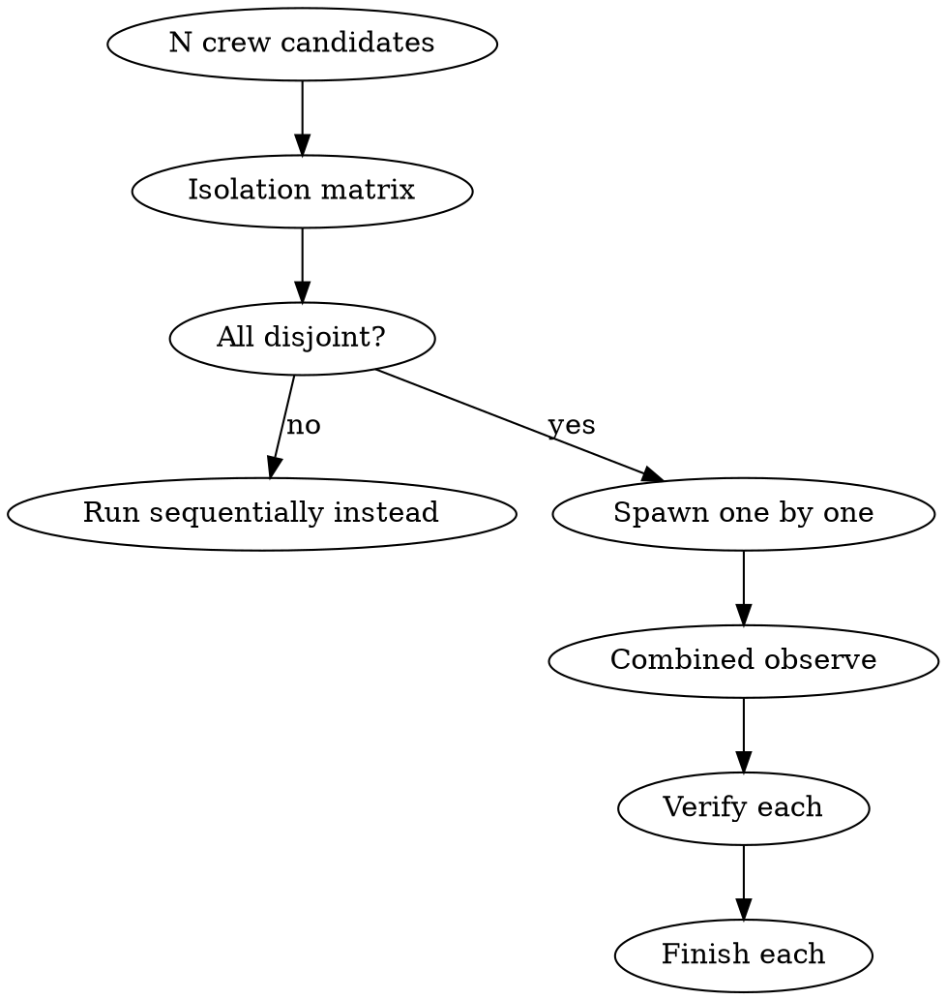

# Dispatching Parallel Crews

## Overview

Muster supports multiple active runs under `.muster/runs/`, but only if they share nothing writable. Parallel dispatch is a flexible skill: the gate is independence, not ritual. If any two crews touch the same mailbox, blackboard key, file path, or git branch, they are not independent — run them sequentially.

**Core principle:** Parallelism requires isolation. Isolation must be provable before spawn.

## When to Use

- User presents multiple crew specs that are unrelated (different features, different files, different branches)
- A batch of independent refactors each has its own spec
- A matrix run: same spec, different input datasets, disjoint outputs

**Don't use when:**
- Crews depend on each other's artifacts (run sequentially)
- Crews write to the same file, branch, or blackboard key
- You haven't verified independence — when in doubt, sequential

## Checklist

1. **List candidate crews** — one spec path per line
2. **Prove pairwise independence** — fill the isolation matrix below
3. **Confirm each spec is ready** — brainstormed, handoff spec clean, contracts green, prompts committed
4. **Spawn each crew sequentially** using `muster:spawning-worker-crew` rules — record run-id per crew
5. **Confirm each manifest shows `active`** — no collisions
6. **Start a combined observe loop** — `muster status` lists all runs
7. **Verify each crew independently** — `muster:verifying-crew-output` per run-id
8. **Finish each crew independently** — `muster:finishing-a-crew-run` per run-id

## Process Flow



## The Isolation Matrix

Fill this table before any spawn. Any shared cell kills parallelism.

| Dimension | Crew A | Crew B | Shared? |
|---|---|---|---|
| Mailbox names | ... | ... | must be NO |
| Blackboard keys | ... | ... | must be NO |
| Output file paths | ... | ... | must be NO |
| Git branch | ... | ... | must be NO |
| External service rate limits | ... | ... | must be NO |
| Spec path | ... | ... | may differ |

Any `YES` in the Shared column → fall back to sequential.

Note that muster scopes mailboxes and blackboard to a run-id, so the same *shape* of mailbox (e.g. `worker-a`) is fine in two crews — different run-ids give different paths:
```
.muster/runs/<run-A>/mailboxes/worker-a.jsonl
.muster/runs/<run-B>/mailboxes/worker-a.jsonl
```

What's NOT scoped: files in the repo, git branches, and external APIs. Those must actually be disjoint.

## Spawning Sequence

Spawn one crew at a time, not concurrently, to avoid race conditions in manifest writing:

```bash
# Crew A
muster run .muster/specs/<slug-a>/<slug-a>.md
RUN_A=$(readlink .muster/runs/latest)

# Crew B
muster run .muster/specs/<slug-b>/<slug-b>.md
RUN_B=$(readlink .muster/runs/latest)

# Verify both active
for R in $RUN_A $RUN_B; do
  jq -r '"\(.run_id) \(.status)"' .muster/runs/$R/manifest.json
done
```

Record both run-ids in your response. `.muster/runs/latest` only points at the last spawn — do not rely on it for the earlier crew.

## Combined Observation

```bash
muster status                      # lists all active runs
for R in $RUN_A $RUN_B; do
  echo "=== $R ==="
  muster tail $R --lines 20
  jq '{status, roster}' .muster/runs/$R/manifest.json
done
```

Run this periodically. If one crew wedges, load `muster:debugging-stuck-mailbox` for that specific run-id — the other crews continue.

## Per-Crew Termination

Each crew finishes on its own timeline. Do not bundle finish actions:

- Verify crew A → finish crew A
- Verify crew B → finish crew B

Do not wait for the slowest crew before integrating the fastest. One finished run and one active run coexist fine.

## Red Flags — STOP

| Thought | Reality |
|---|---|
| "Both crews touch `feature-x` branch, but at different paths" | Same branch = serialized write. Not parallel |
| "They share a blackboard key but only one writes" | The reader will race the writer's restart. Not independent |
| "Same external API, we have plenty of rate limit" | You don't, under load. Treat as shared |
| "I'll spawn them in parallel with `&`" | Manifest writes race. Spawn sequentially, run in parallel |
| "One run-id for both to save directory clutter" | Impossible — mailboxes collide. Each run gets its own id |
| "I'll finish them together at the end" | Premature coupling. Finish as each verifies |

## Common Rationalizations

| Excuse | Reality |
|---|---|
| "Sequential is slow" | Sequential is correct. Correct beats fast when debugging parallel wedges |
| "They only share one file, I'll merge manually" | That's sequential with extra steps. Just run sequential |
| "I'll split one wedge debug between both crews" | Context pollution. One debug session per run-id |

## Integration

**Required sub-skills:** `muster:spawning-worker-crew` (per crew), `muster:verifying-crew-output` (per crew), `muster:finishing-a-crew-run` (per crew).
**Called by:** user with multiple independent specs.
**Pairs with:** `muster:observing-running-crew` (per crew), `muster:debugging-stuck-mailbox` (on per-crew wedge).

## Quick Reference

```
Fill isolation matrix; any shared cell → sequential
Spawn one crew at a time, collect run-ids
muster status shows all
Observe, verify, finish per run-id independently
```

Isolation is the gate. Parallelism is the reward.
