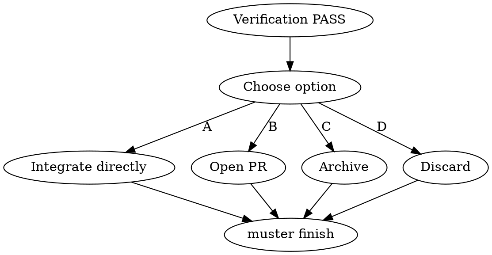

# Finishing a Crew Run

## Overview

A completed crew produces artifacts, mailbox history, transcripts, and a manifest. Forgetting to decide what happens to them leaves `.muster/runs/` cluttered and integration partial. This skill forces a conscious choice between four terminal paths.

**Core principle:** Every crew run ends with a deliberate disposition, not drift.

**Violating the letter of these rules is violating the spirit.**

## The Iron Law

```
NO FINISH ACTION WITHOUT A GREEN VERIFICATION REPORT IN THIS MESSAGE
```

<HARD-GATE>
You MUST NOT run `muster finish`, merge artifacts into the main branch, open a PR, archive the run, or `rm -rf` any run directory until `.muster/runs/<run-id>/verification.md` exists from this conversation and its Conclusion line reads PASS. Paste the Conclusion line before the terminal action.
</HARD-GATE>

## When to Use

- After `muster:verifying-crew-output` reports PASS
- When a user says "wrap it up", "ship it", "we're done here"
- When a crew failed and the user chooses to discard

**Don't use when:** verification is stale or failing, or the run is still active.

## The Four Options



| Option | When | Action |
|---|---|---|
| **A — Integrate** | Artifacts belong on current branch, tests pass, scope is small | Copy/move artifacts, commit, `muster finish <run-id>` |
| **B — PR** | Artifacts want review, are larger, or cross concerns | Create feature branch, commit artifacts, push, `gh pr create`, then `muster finish <run-id>` |
| **C — Archive** | Run is a reference, not a deliverable (experiments, spikes) | Move `.muster/runs/<run-id>` to `.muster/archive/`, `muster finish <run-id>` |
| **D — Discard** | Run was exploratory, wrong approach, or failed acceptance and won't be salvaged | `muster finish <run-id> --discard`, then `rm -rf .muster/runs/<run-id>` after confirmation |

## Checklist

1. **Confirm verification PASS** — read the Conclusion line of `.muster/runs/<id>/verification.md`
2. **Ask the user which option** — present A/B/C/D with one-sentence trade-offs
3. **Execute the chosen option** — follow the per-option steps below
4. **Run `muster finish <run-id>`** — updates manifest `status` to `finished` / `discarded`
5. **Confirm manifest transitioned** — `jq '.status' manifest.json`
6. **Link artifacts in the response** — paths, PR URL, archive location
7. **Clean `.muster/runs/latest` symlink** if pointing at the finished run
8. **Report** — one paragraph summary, option chosen, artifact paths

## Per-Option Steps

### A — Integrate
```bash
cp -r .muster/runs/$RUN_ID/artifacts/* <dest>/
git add <dest>
git commit -m "feat(<scope>): integrate crew $RUN_ID output"
muster finish $RUN_ID
```

### B — Open PR
```bash
git checkout -b muster/$RUN_ID
cp -r .muster/runs/$RUN_ID/artifacts/* <dest>/
git add <dest>
git commit -m "feat(<scope>): crew $RUN_ID output"
git push -u origin muster/$RUN_ID
gh pr create --title "Crew $RUN_ID: <spec title>" \
  --body "Spec: .muster/specs/<slug>/<slug>.md
Verification: .muster/runs/$RUN_ID/verification.md"
muster finish $RUN_ID
```

### C — Archive
```bash
mkdir -p .muster/archive
mv .muster/runs/$RUN_ID .muster/archive/
git add .muster/archive/$RUN_ID
git commit -m "chore(muster): archive run $RUN_ID"
muster finish $RUN_ID
```

### D — Discard
```bash
muster finish $RUN_ID --discard
rm -rf .muster/runs/$RUN_ID
```

Never skip the `muster finish` call, even on discard — it writes the terminal state to the manifest and is what external tools watch.

## Red Flags — STOP

| Thought | Reality |
|---|---|
| "Verification was green an hour ago" | Not in this message. Re-read and paste the Conclusion line |
| "Let me just `rm -rf` the run dir" | Without `muster finish`, the run is still `active` in the manifest and will confuse the next spawn |
| "PR can wait, I'll archive for now" | Pick one deliberately, document it. Don't default-archive to avoid a decision |
| "The user said 'done', that's enough to merge" | Confirm option A vs B explicitly — integration vs review are different |
| "The discard is obvious, skip --discard flag" | The flag writes the reason; next session will ask why this run vanished |
| "Multiple runs can share one `muster finish` call" | No — one call per run-id, each writes its own manifest |

## Common Rationalizations

| Excuse | Reality |
|---|---|
| "Archiving feels wasteful" | The archive is the forensic record for the next failing crew |
| "I'll integrate and PR later" | "Later" means the artifacts bit-rot against main |
| "Skip `muster finish`, the manifest is only used internally" | External observers (dashboards, hooks, next spawn gate) all read it |

## Integration

**Required sub-skills:** `muster:verifying-crew-output` (must PASS in this turn).
**Called by:** `muster:verifying-crew-output` on green.
**Pairs with:** `muster:spawning-worker-crew` (closes the loop), `muster:dispatching-parallel-crews` (each child run needs its own finish).

## Quick Reference

```
Verification PASS in this message?  (if no → debug)
Ask user: A integrate | B PR | C archive | D discard
Execute chosen steps
muster finish <run-id>   (always, even on discard)
jq .status manifest.json → finished | discarded
Report artifact locations
```

Deliberate end, always. No drift.
