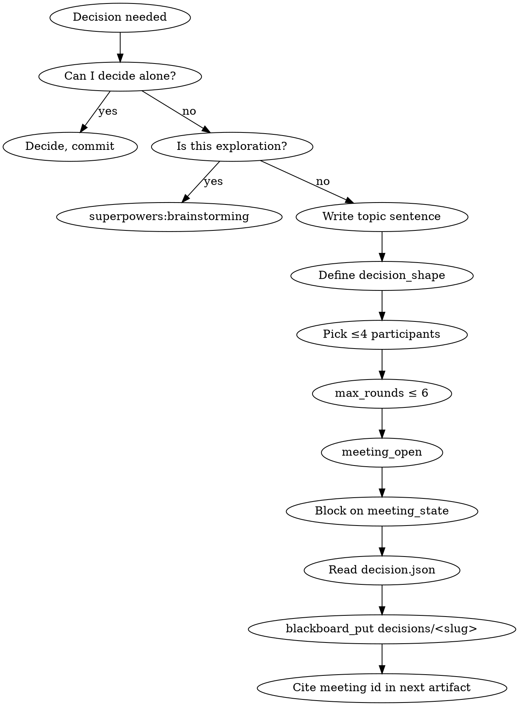

# Holding a Muster Meeting

## Overview

A muster meeting is a coordinator-driven, round-based conversation. The orchestrator spawns one participant per round, feeds it the running transcript, captures its single reply, and closes with a schema-validated decision artifact. Meetings are the only muster primitive for structured multi-party deliberation — everything else (mailbox_send, task_claim, blackboard) is for artifact exchange.

**Core principle:** A meeting is a decision, not a chat log. If there's no decision shape, there's no meeting.

**Violating the letter of these rules is violating the spirit.**

## The Iron Law

```
ONE MEETING PER DECISION. IF YOU OPEN A SECOND MEETING ON THE SAME TOPIC, YOU SKIPPED A QUESTION IN THE FIRST ONE. REOPEN IT, DO NOT BRANCH.
```

<HARD-GATE>
You MUST NOT call `meeting_open` until: (1) you have written a one-sentence topic that names a concrete decision, (2) the `decision_shape` JSON Schema is defined before the meeting opens and captured in `spec.json`, (3) participants are picked by role with a one-line justification per participant in `spec.json`, (4) `max_rounds` is set to 6 or fewer, (5) no other meeting with the same topic slug is currently active or finished in this run. Paste the spec before calling `meeting_open`.
</HARD-GATE>

## When to Use

**Trigger:** you hit a decision that (a) affects 2+ specialist roles, (b) has more than one defensible answer, (c) you cannot make alone without risking rework.

- Architecture trade-offs where a planner and a reviewer disagree
- Scope changes mid-run
- Conflict resolution between workers
- Formal review of a risky artifact before integration
- Any point where you were about to write a Mailbox PING-PONG chain

**Don't use when:**
- Simple Q&A between two agents → use `mailbox_send`
- You already know the answer → commit the answer, don't simulate consensus
- You're exploring, not deciding → use `superpowers:brainstorming` with one agent first
- You are a worker spawned inside a crew that is already in a meeting — workers cannot open nested meetings

## Checklist

1. **Write the topic** — one sentence naming the decision. If you can't, you don't have a meeting, you have a vibe. Stop.
2. **Define `decision_shape`** — the JSON Schema the closer must fill. Before the meeting opens. If you can't shape the answer, you can't recognize one.
3. **Pick ≤4 participants by role** — justify each in `spec.json`. Role, not name.
4. **Set `max_rounds ≤ 6`** — anything longer means the topic is too big; split it.
5. **Call `meeting_open`** with the completed spec
6. **Block on `meeting_state`** or let the run phase handle it
7. **On close, read `decision.json`** — validate against `decision_shape`
8. **Publish the decision** — put it on the blackboard under `decisions/<topic-slug>.json`
9. **Cite the meeting id** — in the next commit message or artifact: `Refs meeting m_abc123`
10. **Clean up** — if you need to retry, adjourn the old meeting first; never spawn a parallel meeting on the same topic

## Process Flow



## Meeting Spec (what you pass to `meeting_open`)

```json
{
  "topic": "Which retry strategy for billing webhook failures",
  "participants": [
    {
      "agent_name": "payments-architect",
      "role": "architect",
      "justification": "Owns the webhook handler design",
      "priority": 1
    },
    {
      "agent_name": "sre-reviewer",
      "role": "reviewer",
      "justification": "Owns SLO and alerting budget",
      "priority": 2
    },
    {
      "agent_name": "security-reviewer",
      "role": "security",
      "justification": "Must sign off on idempotency and replay protection",
      "priority": 3
    }
  ],
  "rules": {
    "strategy": "round_robin",
    "max_rounds": 6,
    "turn_timeout_s": 120,
    "meeting_deadline_s": 900
  },
  "decision_shape": {
    "$schema": "https://json-schema.org/draft/2020-12/schema",
    "type": "object",
    "required": ["strategy", "max_retries", "backoff", "rationale"],
    "additionalProperties": false,
    "properties": {
      "strategy": { "enum": ["linear", "exponential", "token-bucket"] },
      "max_retries": { "type": "integer", "minimum": 1, "maximum": 10 },
      "backoff": { "type": "string", "pattern": "^[0-9]+(s|ms)$" },
      "rationale": { "type": "string", "minLength": 20 }
    }
  }
}
```

## Economic Model

Meetings cost **linearly in rounds**, not rounds × participants. Only the active speaker per round is spawned; dormant participants are reconstituted next time their turn comes up with the full transcript as context. A 6-round, 4-participant meeting = 6 spawns.

Hard caps in v0:
- Participants ≤ 6
- `max_rounds` ≤ 20
- `turn_timeout_s` ≤ 300
- One meeting per agent at a time (enforced by the orchestrator)
- No nested meetings (platform constraint: subagents cannot spawn subagents)

## Termination Precedence

1. Explicit `meeting_adjourn` — wins immediately
2. Validated `decision.json` produced by the closer
3. `max_rounds` reached
4. `meeting_deadline_s` exceeded

A closer always runs at the end, even on timeout. There is always a `decision.json` — possibly with `status: "inconclusive"` and a reason.

## Debugging a Meeting

```bash
RUN_ID=$(readlink .muster/runs/latest)
MEETING_ID=m_abc123

# Live transcript
tail -f .muster/runs/$RUN_ID/meetings/$MEETING_ID/transcript.jsonl \
  | jq -r '"\(.round)  \(.speaker): \(.text)"'

# Current state
jq . .muster/runs/$RUN_ID/meetings/$MEETING_ID/state.json

# Decision after close
jq . .muster/runs/$RUN_ID/meetings/$MEETING_ID/decision.json
```

If a participant fails repeatedly, load `muster:debugging-stuck-mailbox` and treat the meeting as a wedged coordinator.

## Red Flags — STOP

| Thought | Reality |
|---|---|
| "Open a meeting to figure out what we should decide" | That's brainstorming with extra steps. Decide the decision first, then meet |
| "Every participant has the same role" | Not a meeting — it's a focus group. Pick distinct roles |
| "`decision_shape: {text: string}`" | That's a chat log, not a decision. Give it real structure |
| "Participant list includes 'everyone' or >6 agents" | The meeting will thrash. Cap at 4 for v0 |
| "Topic contains 'and'" | Split it into two meetings, or one meeting with two decisions in the shape |
| "Let me re-open the same topic with different participants" | No. Adjourn the first meeting, salvage its transcript, open one new meeting |
| "I'll have the coordinator speak every round to keep things on track" | Moderator is a role attribute. Use it instead of re-speaking |

## Common Rationalizations

| Excuse | Reality |
|---|---|
| "Meetings are expensive" | Not if they replace 5 rounds of mailbox ping-pong. Count the spawns |
| "We can extract the decision from the transcript programmatically" | Regex extraction of LLM output is how bugs ship. The closer writes `decision.json` against a schema |
| "`max_rounds: 20` leaves room to breathe" | 20 rounds × 6 participants = a small essay per agent. Split it |
| "I'll open a parallel meeting to explore an alternative" | One meeting per decision. Alternatives are arguments within the meeting |

## Integration

**Required sub-skills:** `muster:using-muster` (always), `muster:observing-running-crew` (called with a live run).
**Called by:** a worker prompt, or the coordinator, when a blocking decision arises.
**Pairs with:** `muster:verifying-crew-output` (reads `decisions/<slug>.json` from the blackboard), `muster:debugging-stuck-mailbox` (on meeting wedge).

## Quick Reference

```
One-sentence topic
decision_shape JSON Schema (before open)
≤4 participants by role, justified
max_rounds ≤ 6
meeting_open → block on meeting_state → read decision.json
blackboard_put decisions/<slug>.json
Cite meeting id in next artifact
```

No decision shape, no meeting. No exceptions.
