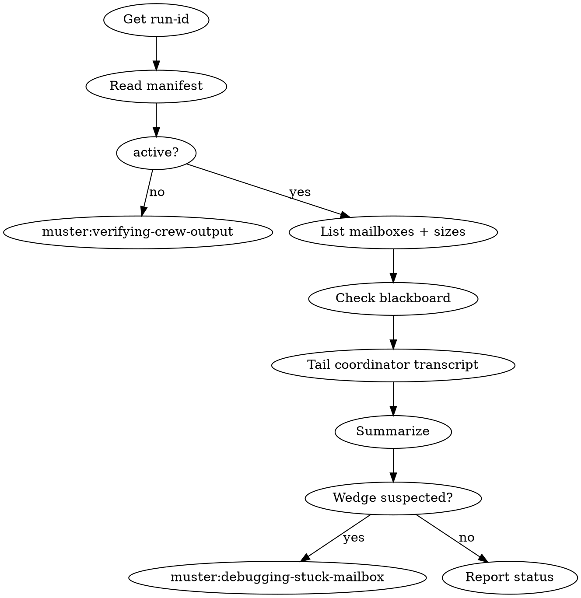

# Observing a Running Crew

## Overview

Observing is read-only. A careless observer can still cause harm: holding a `mailbox_wait` blocks other consumers, `tail -f` on a growing file is fine but `mailbox_read` with pop semantics consumes messages. This skill is flexible, not rigid — but the read-only invariant is non-negotiable.

**Core principle:** Observation never mutates state. If you had to write, you were debugging — different skill.

## When to Use

- User asks "how is the crew doing?", "what's happening?", "tail it"
- You need situational awareness before running `muster:debugging-stuck-mailbox`
- Periodic status check during a long run

**Don't use when:** the run is finished (use `muster:verifying-crew-output`), or a mailbox is wedged and you need to mutate state (use `muster:debugging-stuck-mailbox`).

## Checklist

1. **Identify the run-id** — from `.muster/runs/latest` or user input
2. **Read the manifest** — confirm `status` is `active`
3. **List mailboxes and their sizes** — `wc -l` on each JSONL
4. **Check blackboard state** — list keys, read sizes
5. **Tail the coordinator transcript** — last 50 lines
6. **Summarize to the user** — progress, lag, anomalies
7. **Decide next step** — continue observing, debug, or finish

## Process Flow



## Safe Commands

All read-only. Memorize these.

```bash
RUN_ID=$(readlink .muster/runs/latest)

# status
muster status
muster tail $RUN_ID --lines 50

# manifest
jq '{status, roster, spawned_at, finished_at}' .muster/runs/$RUN_ID/manifest.json

# mailbox depths
for mb in .muster/runs/$RUN_ID/mailboxes/*.jsonl; do
  printf '%-40s %s\n' "$(basename $mb)" "$(wc -l < $mb)"
done

# blackboard
ls .muster/runs/$RUN_ID/blackboard/
jq . .muster/runs/$RUN_ID/blackboard/<key>.json

# transcript (tail, do not grep-consume)
tail -n 50 .muster/runs/$RUN_ID/transcripts/agent-coordinator.jsonl

# per-agent inspect
muster inspect <agent-id>
```

## Forbidden Commands

Never, during observation:

- `mailbox_read` with pop — use `jq` on the JSONL file instead
- `mailbox_wait` — blocks a slot the coordinator may want
- `task_claim` — mutates assignment state
- `blackboard_put` — writes state
- `muster finish` — terminal action
- Editing any file under `.muster/runs/<run-id>/`

## What To Report

A good status report answers four questions in order:

1. **Topology:** how many workers, which roles, are they all alive
2. **Progress:** mailbox depths over time (if you have a prior snapshot), blackboard keys present vs expected
3. **Anomalies:** mailbox with no recent writes for >5 minutes, worker transcript stuck on same tool call, errors in transcripts
4. **Next step:** continue observing, escalate to debugging, or declare near-done

## Wedge Heuristics (triggers debug skill)

Any of these means stop observing and load `muster:debugging-stuck-mailbox`:

- A mailbox has grown but no consumer has read in >10 minutes
- A worker transcript's last entry is >15 minutes old while manifest says `active`
- Blackboard key expected by the termination condition is missing after expected time
- Two workers are writing to the same mailbox and contents look interleaved/corrupt
- Coordinator transcript shows repeated identical messages (loop)

## Red Flags — STOP

| Thought | Reality |
|---|---|
| "Let me `mailbox_read` to see what's in there" | That consumes. Use `jq` on the file |
| "I'll `mailbox_wait` with a short timeout" | Still blocks a consumer slot. Read the file |
| "I'll restart the coordinator, it looks stuck" | That's mutation. Load the debug skill first |
| "The last message was 8 minutes ago, still fine" | Compare to the normal cadence for this crew. 8 minutes may already be wedged |
| "I'll grep transcripts with `>` redirect" | Redirects create files under `.muster/runs/`, polluting the run |

## Common Rationalizations

| Excuse | Reality |
|---|---|
| "One `mailbox_read` won't hurt" | It consumes a message the consumer needed |
| "I need to poke it to see if it's alive" | Health ≠ prodding. Check transcript timestamps |
| "Tail is the same as read" | Tail is read-only on the file; `mailbox_read` is a consuming API call |

## Integration

**Required sub-skills:** None, but typically called after `muster:spawning-worker-crew`.
**Called by:** `muster:spawning-worker-crew`, ad hoc during user check-ins.
**Pairs with:** `muster:debugging-stuck-mailbox` (on wedge), `muster:verifying-crew-output` (on completion).

## Quick Reference

```
RUN_ID=$(readlink .muster/runs/latest)
muster status && muster tail $RUN_ID
wc -l mailboxes/*.jsonl
jq manifest.json
Report: topology, progress, anomalies, next step
```

Read-only, always. Mutation means you escalated to the wrong skill.
