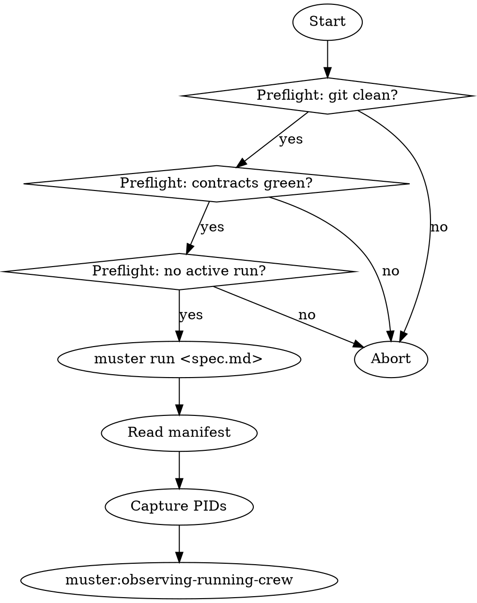

# Spawning a Worker Crew

## Overview

Spawning is the irreversible moment. Once `muster run` writes a manifest and starts workers, the files under `.muster/runs/<run-id>/` become ground truth. Dirty state, missing contracts, or stale prompts all bake in here.

**Core principle:** A spawn is a deployment. Pre-flight everything.

**Violating the letter of these rules is violating the spirit.**

## The Iron Law

```
NO `muster run` ON A DIRTY WORKSPACE OR WITHOUT A GREEN CONTRACT TEST IN THIS MESSAGE
```

<HARD-GATE>
You MUST NOT invoke `muster run <spec.md>` until: (1) `git status --porcelain` shows zero lines OR every unstaged file is listed and explicitly acknowledged by the user, (2) the contract test suite was run in this conversation turn and shows zero failures, (3) the target spec file exists and was committed, (4) no prior run under `.muster/runs/` is still `active` according to its `manifest.json`. Paste the output of each check before the spawn.
</HARD-GATE>

## When to Use

- First launch of a newly approved crew
- Re-launch after a finished run (previous run archived or discarded)
- Scaling out an existing spec with more workers (still counts as a new run)

**Don't use when:** a prior run is still active (use `muster:observing-running-crew`), or prompts/contracts are not committed.

## Checklist

1. **Check git status** — `git status --porcelain`, must be empty
2. **Re-run contract tests** — paste green output
3. **Confirm spec and prompts exist** — list files
4. **Check for active runs** — `jq '.status' .muster/runs/*/manifest.json`
5. **Pick the run-id strategy** — auto (default) or explicit via `--run-id`
6. **Invoke `muster run <spec.md>`** — with any flags decided above
7. **Capture run-id** — from stdout or `.muster/runs/latest` symlink
8. **Read the manifest** — `.muster/runs/<run-id>/manifest.json`, confirm `status: active`, roster matches spec
9. **Record PIDs and mailbox paths** — echo into your response
10. **Hand off to `muster:observing-running-crew`**

## Process Flow



## Preflight Commands

Run each, paste output:

```bash
# 1. Clean worktree
git status --porcelain

# 2. Contracts green (adjust runner per project)
go test ./.muster/specs/<slug>/contracts/...

# 3. Spec + prompts committed
git ls-files .muster/specs/<slug>/

# 4. No active runs
for m in .muster/runs/*/manifest.json; do
  [ -f "$m" ] && jq -r '"\(.run_id) \(.status)"' "$m"
done
```

## The Spawn

```bash
muster run .muster/specs/<slug>/<slug>.md
```

Optional flags you may use:
- `--run-id <explicit>` — when retrying a specific name
- `--log-level debug` — for the first run of a new spec
- `--dry-run` — prints the manifest it would write; use once before the real spawn

## Post-Spawn Capture

Immediately after `muster run` returns:

```bash
RUN_ID=$(readlink .muster/runs/latest)
cat .muster/runs/$RUN_ID/manifest.json | jq '{run_id, status, roster, spawned_at}'
ls .muster/runs/$RUN_ID/mailboxes/
```

Paste the output. This becomes the reference for every subsequent observe/debug turn.

## Red Flags — STOP

| Thought | Reality |
|---|---|
| "Uncommitted changes are just formatting" | They change worker prompt contents — forbidden |
| "Contracts passed yesterday" | Not this message. Run them now |
| "The old run is probably done" | Check the manifest. `active` means another crew will collide on mailboxes |
| "`--dry-run` is a waste of time" | On first spawn of a new spec it catches manifest errors cheaply |
| "The run-id in logs is fine, skip the symlink read" | `.muster/runs/latest` is the canonical handle, use it |
| "Let me tweak the prompt and re-spawn without committing" | Prompt drift is the #1 cause of irreproducible wedges |

## Common Rationalizations

| Excuse | Reality |
|---|---|
| "I already ran contracts in a previous turn" | Context compaction may hide failures. Re-run |
| "Stashing is as good as committed" | Stash is local and invisible to the manifest. Commit |
| "We can skip the active-run check, I'd notice" | You won't. Two active crews writing the same mailbox is hours of debugging |

## Integration

**Required sub-skills:** `muster:defining-mailbox-contracts`, `muster:writing-worker-prompt`.
**Called by:** `muster:writing-worker-prompt` after commit.
**Pairs with:** `muster:observing-running-crew` (next), `muster:finishing-a-crew-run` (terminal), `muster:dispatching-parallel-crews` (multi-crew).

## Quick Reference

```
Preflight: git clean + contracts green + no active run + spec committed
muster run .muster/specs/<slug>/<slug>.md
Read manifest, capture PIDs, hand off to muster:observing-running-crew
```

Dirty spawn = lost run. No exceptions.
