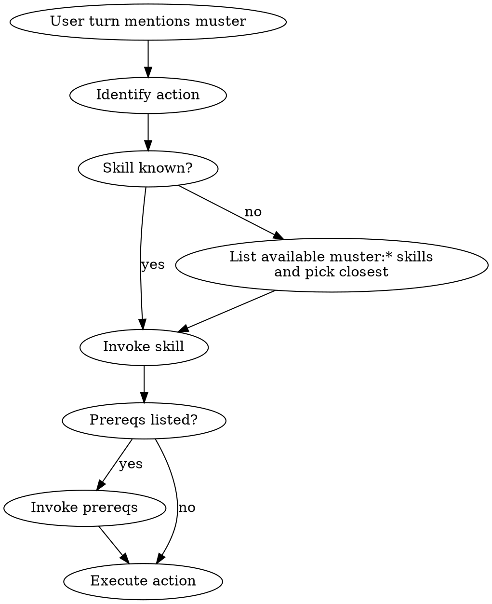

# Using Muster

## Overview

Muster is a headless multi-agent harness. It only behaves consistently when you load the right skill before each action. This skill is the entry gate: it teaches you how to find muster skills, how to prioritize them against other instructions, and what to do before touching any muster command.

**Core principle:** Every muster action is preceded by loading the skill that governs it. No exceptions.

**Violating the letter of these rules is violating the spirit.**

## The Iron Law

```
NO MUSTER TOOL CALL WITHOUT THE GOVERNING SKILL LOADED IN THIS MESSAGE
```

<HARD-GATE>
You MUST NOT run `muster run`, `muster status`, `muster tail`, `muster inspect`, `muster finish`, or call any `mailbox_*`, `blackboard_*`, `meeting_*`, `task_claim`, or `roster` MCP tool until you have invoked the muster skill that governs the current action in this conversation turn. "I already know how" does not count. Skill invocation proves the rules are loaded.
</HARD-GATE>

## When to Use

**Always, at the start of any turn that:**
- Mentions muster, crews, workers, coordinators, handoffs, meetings
- References `.muster/runs/`, mailboxes, blackboard, manifests
- Asks to spawn, launch, observe, debug, or finish any crew
- Contains the string "muster" in the user's message or in a pending todo

**Use ESPECIALLY when:**
- You think you remember how muster works from training data — you don't
- The user is impatient and says "just run it"
- A previous turn in this session already loaded a skill — context compaction may have dropped it

**Don't use when:** the conversation has nothing to do with muster. Silence is fine.

## Priority Ordering

When instructions conflict, apply them in this order (highest wins):

1. **Explicit user instructions in the current turn** — the user can override anything
2. **Muster skills loaded in this conversation** — the rulebook for the action
3. **Muster system prompt / CLAUDE.md** — project defaults
4. **Your training priors** — lowest priority; assume they are stale

If a muster skill and your priors disagree, the skill wins. If the user and a skill disagree, the user wins — but ask them to confirm the override explicitly before bypassing a HARD-GATE.

## Checklist

Create a TodoWrite task for each:

1. **Identify the muster action** — spawn, observe, debug, verify, finish, dispatch, write skill, brainstorm crew, write handoff, define contract, write worker prompt, hold meeting
2. **Load the governing skill** — invoke it via the Skill tool before any other tool call
3. **Confirm priority** — if user instructions conflict with the skill, ask before bypassing HARD-GATEs
4. **Find sibling skills** — check the Integration section of the loaded skill for required prerequisites
5. **Chain prerequisite skills** — load them too, in order
6. **Execute the action** — only after all required skills are loaded
7. **Log the skill chain** — mention in your response which skills you loaded, so the user can audit

## Process Flow



## How to Find a Muster Skill

Muster skills are namespaced `muster:<action>`. They follow a verb-object naming pattern. Use this action → skill map:

| Action | Skill |
|---|---|
| Turn an idea into a crew spec | `muster:brainstorming-crew` |
| Convert approved brainstorm to a handoff | `muster:writing-handoff-spec` |
| Design mailbox JSONL schemas | `muster:defining-mailbox-contracts` |
| Write the prompt a worker will run | `muster:writing-worker-prompt` |
| Launch the crew | `muster:spawning-worker-crew` |
| Watch a running crew | `muster:observing-running-crew` |
| Diagnose a wedged mailbox | `muster:debugging-stuck-mailbox` |
| Prove a crew's output is correct | `muster:verifying-crew-output` |
| Decide integrate / PR / archive / discard | `muster:finishing-a-crew-run` |
| Run multiple crews in parallel | `muster:dispatching-parallel-crews` |
| Hold a structured multi-party meeting | `muster:hold-meeting` |
| Authoring a new muster skill | `muster:writing-muster-skill` |

If no skill matches, STOP and ask the user which skill to use. Do not improvise.

## Red Flags — STOP

| Thought | Reality |
|---|---|
| "I already know how `muster run` works" | Training data is stale; the skill encodes current flags and gates |
| "Let me just peek at the manifest first" | Reading `.muster/runs/<id>/manifest.json` is still a muster action; load `muster:observing-running-crew` |
| "This is a tiny change, no skill needed" | Every tiny change to `.muster/` has blown up a crew before |
| "The user told me to skip the brainstorm" | Ask them to confirm explicitly — do not assume override of a HARD-GATE |
| "I loaded a skill 20 turns ago" | Compaction likely dropped it; reload |
| "I'll load the skill after I run the command" | Too late. The skill configures what commands to run |

## Common Rationalizations

| Excuse | Reality |
|---|---|
| "Skill invocation wastes tokens" | A wedged crew wastes more tokens than every skill load combined |
| "The user is in a hurry" | The user hired you so they don't have to babysit — skills are the babysitter |
| "I can reconstruct the rules from memory" | You cannot. The rules change between muster versions |
| "I'm just reading, not mutating" | Reading mailboxes during a run can wedge waiters. Load the skill |

## Integration

**Required sub-skills:** None — this is the root.
**Called by:** Every muster turn. This is the first skill loaded.
**Pairs with:** `muster:writing-muster-skill` (when authoring), every other `muster:*` skill (when acting).

## Quick Reference

```
1. User mentions muster → load muster:using-muster (this skill)
2. Identify the verb in their request → load the matching muster:<action> skill
3. Check the skill's Integration section → load prerequisite skills
4. Run the muster command
```

If in doubt, ask. Never guess a muster skill's name.
