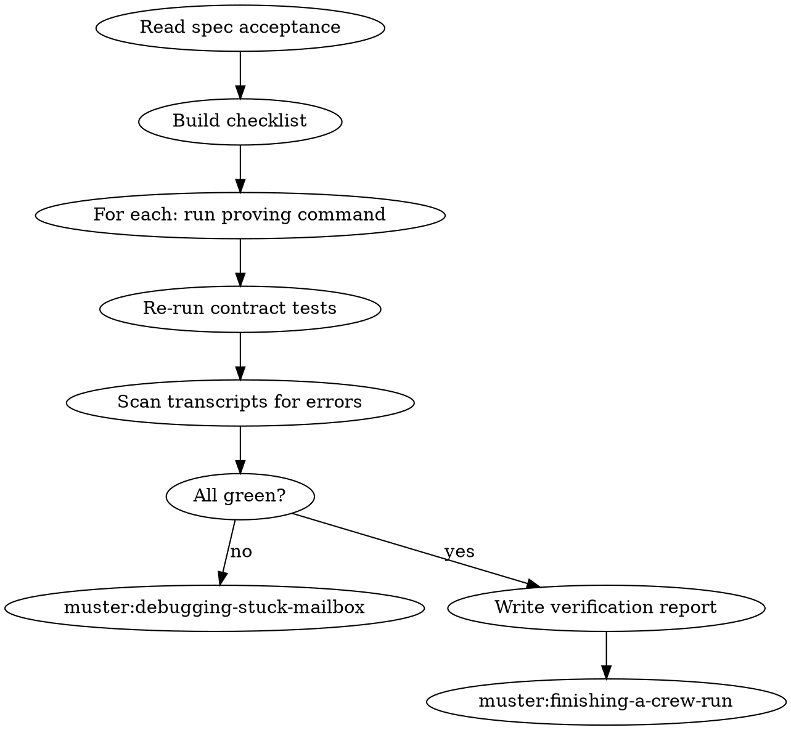

# Verifying Crew Output

## Overview

"Done" claims are cheap. A muster crew that reports success may still have half-empty mailboxes, missing artifacts, or a silently failed worker. This skill is the evidence gate before `muster:finishing-a-crew-run`.

**Core principle:** A claim without fresh evidence is dishonesty.

**Violating the letter of these rules is violating the spirit.**

## The Iron Law

```
NO "DONE" CLAIM WITHOUT EVIDENCE GATHERED IN THIS MESSAGE FOR EVERY ACCEPTANCE ITEM
```

<HARD-GATE>
You MUST NOT invoke `muster:finishing-a-crew-run`, say "the crew is done", or mark any verification todo complete until you have: (1) opened the spec, (2) produced a line-by-line checklist of acceptance criteria, (3) attached a command and its output to each line, (4) re-run contract tests against the current mailbox files. One missing evidence line = gate closed.
</HARD-GATE>

## When to Use

- Crew reports `status: finished` in its manifest
- Coordinator writes the termination signal
- User asks "is it done?" and you have to answer with evidence
- Before any `muster finish` or `muster:finishing-a-crew-run` invocation

**Don't use when:** the run is still active with pending workers (`muster:observing-running-crew`), or the run is clearly broken (`muster:debugging-stuck-mailbox`).

## Checklist

1. **Locate the spec** — `.muster/specs/<slug>/<slug>.md`
2. **Copy the Acceptance Criteria section** verbatim into a local checklist
3. **For each criterion, identify the proving command** — file existence, test, diff, schema check
4. **Run each command fresh in this turn** — no stale output
5. **Re-run all contract tests** against the final mailbox files
6. **Diff the final artifacts** against expected — git status, file hashes, content
7. **Scan worker transcripts** for error lines — `grep -iE 'error|fatal|panic|stuck'`
8. **Fill a verification report** — see template
9. **Present the report** — to the user before any finish action
10. **Hand off to `muster:finishing-a-crew-run`** only if every line is green

## Process Flow



## The Verification Report Template

Write to `.muster/runs/<run-id>/verification.md`:

```markdown
# Verification: <run-id>

**Spec:** .muster/specs/<slug>/<slug>.md
**Verified at:** <timestamp>

## Acceptance Checklist

| # | Criterion | Command | Output | Status |
|--:|-----------|---------|--------|:------:|
| 1 | <copied verbatim> | `<cmd>` | <paste output> | PASS |
| 2 | ... | ... | ... | PASS |

## Contract Re-run

(paste `go test ./.muster/specs/<slug>/contracts/...` output)

## Transcript Error Scan

(paste `grep -iE 'error|fatal|panic|stuck' .muster/runs/<id>/transcripts/*` output)

## Artifact Diff

(paste relevant git status / diff output)

## Conclusion
PASS — proceed to finish | FAIL — back to debug
```

## Proving Commands — Examples

| Acceptance line | Proving command |
|---|---|
| "All tasks have a result message" | `wc -l` on inbox vs outbox, must match |
| "Blackboard `result` is set" | `jq . .muster/runs/$RUN_ID/blackboard/result.json` |
| "Every worker exited 0" | `jq '.workers[].exit_code' manifest.json` |
| "PR artifact exists at path X" | `test -f X && head X` |
| "No schema violations in any mailbox" | contract round-trip test against each JSONL |
| "Test suite passes" | full suite runner, paste tail |

If an acceptance line has no proving command, the spec is under-specified — STOP and either add a command or treat the line as failed.

## Transcript Error Scan

```bash
RUN_ID=$(readlink .muster/runs/latest)
grep -niE 'error|fatal|panic|stuck|wedge' .muster/runs/$RUN_ID/transcripts/*.jsonl
```

Non-empty output is not automatically a fail — workers may have recovered — but every hit must be explained in the report.

## Red Flags — STOP

| Thought | Reality |
|---|---|
| "Coordinator said it's done" | Coordinator is a worker. Verify independently |
| "Contract tests passed at spawn" | They must pass against the FINAL mailbox files too |
| "Acceptance list is obvious, no checklist needed" | The checklist is the evidence trail. Write it |
| "Error lines in transcripts are just retries" | Explain each one or debug |
| "I'll skip the re-run, suites are slow" | Stale test output is no output |
| "Report is overkill for a 2-worker crew" | Two workers is when one silently fails and you don't notice |

## Common Rationalizations

| Excuse | Reality |
|---|---|
| "Manifest says finished, that's proof" | Finished status does not imply acceptance met |
| "The user will trust my summary" | They'll trust the evidence. Paste commands |
| "I already verified during debugging" | Debug and verify are different. Re-run now |

## Integration

**Required sub-skills:** `muster:observing-running-crew` (to confirm run is in terminal state).
**Called by:** `muster:observing-running-crew` on clean termination, `muster:finishing-a-crew-run` as prerequisite.
**Pairs with:** `muster:finishing-a-crew-run` (next), `muster:debugging-stuck-mailbox` (on fail).

## Quick Reference

```
Open spec → copy acceptance lines → command+output per line
Re-run contracts against final mailboxes
Scan transcripts for errors
Write .muster/runs/<id>/verification.md
All green → muster:finishing-a-crew-run
Any red → muster:debugging-stuck-mailbox
```

Evidence before claims. Always.
