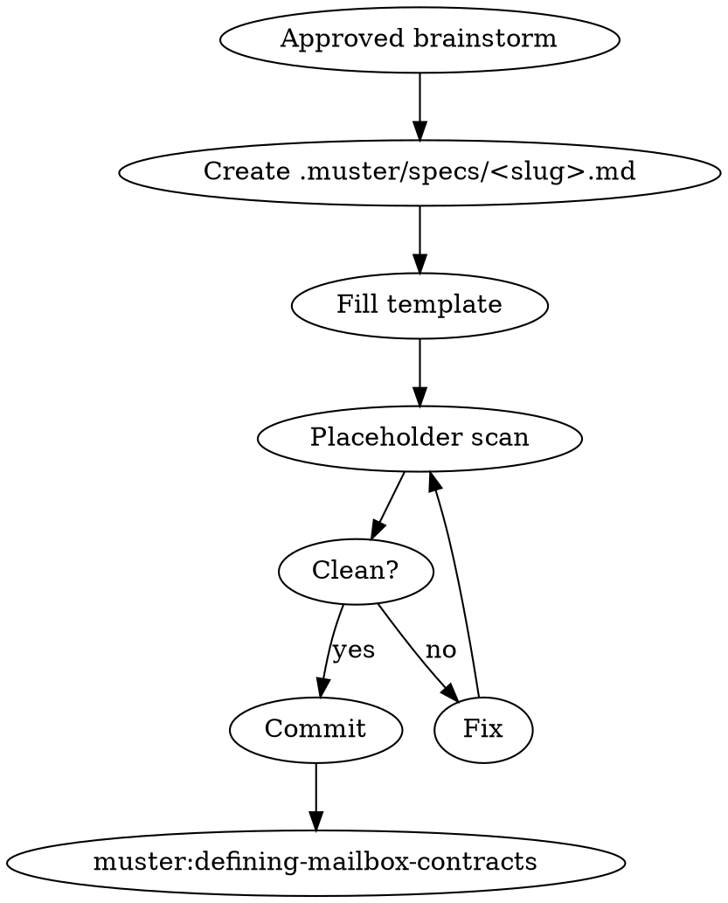

# Writing a Crew Handoff Spec

## Overview

The handoff spec is the single source of truth a coordinator and every worker reads at startup. It lists roles, mailbox edges, blackboard keys, termination rules, and acceptance criteria. Ambiguity here propagates to every worker.

**Core principle:** If a reasonable worker could interpret the spec two ways, the spec is wrong.

**Violating the letter of these rules is violating the spirit.**

## The Iron Law

```
NO CONTRACT DESIGN, NO WORKER PROMPT, NO SPAWN UNTIL THE SPEC HAS ZERO TBDs AND ZERO PLACEHOLDERS
```

<HARD-GATE>
You MUST NOT invoke `muster:defining-mailbox-contracts`, `muster:writing-worker-prompt`, or `muster:spawning-worker-crew` until `.muster/specs/<slug>.md` exists, has been committed, and has been scanned clean of the strings `TBD`, `TODO`, `???`, `<fill in>`, `FIXME`. Run the scan as a command and paste the output showing zero hits before proceeding.
</HARD-GATE>

## When to Use

- Immediately after `muster:brainstorming-crew` returns approval
- When an existing spec needs a rewrite after a failed run
- When a user provides a spec-shaped document but it lacks mailbox edges or termination rules

**Don't use when:** the brainstorm is not yet approved, or when iterating mid-run on a live crew (use `muster:debugging-stuck-mailbox` instead).

## Checklist

1. **Load the approved brainstorm summary** — from the prior turn
2. **Create the spec file** — `.muster/specs/<YYYY-MM-DD>-<slug>.md`
3. **Fill every required section** — see template below
4. **Enumerate mailbox edges** — producer → consumer, direction, max depth
5. **Enumerate blackboard keys** — owner, readers, schema reference
6. **Define termination condition** — concrete and machine-checkable
7. **Define acceptance criteria** — what `muster:verifying-crew-output` will check
8. **Run the placeholder scan** — grep for `TBD|TODO|\?\?\?|FIXME|<fill`
9. **Commit the spec** — conventional commit, `spec(muster): add <slug>`
10. **Hand off to `muster:defining-mailbox-contracts`**

## Process Flow



## The Template

```markdown
# Crew Spec: <slug>

**Created:** YYYY-MM-DD
**Status:** draft | active | archived

## Goal
<one sentence, measurable>

## Roles
| Role | Count | Responsibility |
|------|------:|----------------|
| coordinator | 1 | ... |
| worker-a | 2 | ... |

## Mailbox Edges
| From → To | Message Type | Max Depth | Notes |
|-----------|--------------|----------:|-------|
| coordinator → worker-a | task.assign | 50 | fan-out |
| worker-a → coordinator | task.result | 100 | fan-in |

## Blackboard Keys
| Key | Owner | Readers | Schema |
|-----|-------|---------|--------|
| `run.config` | coordinator | all | config.schema.json |
| `result` | coordinator | external | result.schema.json |

## Termination
<exact condition, e.g. "coordinator writes blackboard key `result` AND all worker mailboxes are drained">

## Acceptance Criteria
- [ ] <checkable item>
- [ ] <checkable item>

## Failure Modes Watched
- <mode>: <detection>: <action>

## Out of Scope
- ...
```

## Placeholder Scan

Run this exact command and paste the output:

```bash
grep -nE 'TBD|TODO|\?\?\?|FIXME|<fill' .muster/specs/<slug>.md || echo "clean"
```

Only the literal string `clean` on stdout means you may proceed. Any line hit means stop and fix.

## Red Flags — STOP

| Thought | Reality |
|---|---|
| "I'll leave TBD on the termination condition, we'll figure it out" | That TBD is a guaranteed wedge — the coordinator won't know when to stop |
| "Max depth doesn't matter, JSONL grows infinitely" | It does. Unbounded mailboxes are a known wedge class |
| "Acceptance criteria = 'it works'" | Not machine-checkable. Rewrite |
| "Let me just reference the brainstorm summary instead of a spec file" | The subagents can't read your conversation. They read the file |
| "The spec is in a doc comment in the prompt" | Specs live at `.muster/specs/<slug>.md` — nowhere else |
| "Two workers share the same mailbox for writes, that's fine" | Multiple writers to one mailbox need explicit coordination; document it or forbid it |

## Common Rationalizations

| Excuse | Reality |
|---|---|
| "Spec is internal, skip the commit" | Uncommitted specs get overwritten mid-run |
| "Template is too rigid for this crew" | Every section has a reason. If one truly doesn't apply, write "N/A — <why>" explicitly |
| "I'll scan for placeholders by eye" | You'll miss one. Run the grep |

## Integration

**Required sub-skills:** `muster:brainstorming-crew` (must run first).
**Called by:** `muster:brainstorming-crew` after approval.
**Pairs with:** `muster:defining-mailbox-contracts` (next step), `muster:verifying-crew-output` (reads the acceptance criteria at the end).

## Quick Reference

```
.muster/specs/<date>-<slug>.md
All sections filled.
grep TBD|TODO|???|FIXME|<fill → "clean"
Committed.
→ muster:defining-mailbox-contracts
```

Fuzzy spec = wedged crew. No exceptions.
