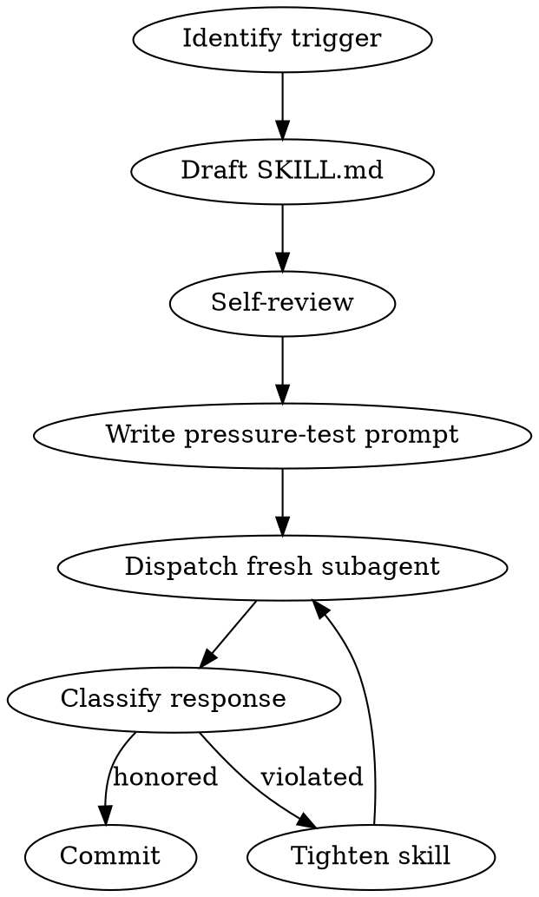

# Writing a Muster Skill

## Overview

Muster skills fail silently: a rigid skill without a real HARD-GATE reads fine but won't hold under pressure. The only way to know a skill works is to hand it to a fresh Claude subagent and watch them try to violate it. This skill is TDD applied to skill authoring.

**Core principle:** If you haven't watched a subagent fail against the skill, you don't know if it's rigid.

**Violating the letter of these rules is violating the spirit.**

## The Iron Law

```
NO SKILL COMMIT WITHOUT A DOCUMENTED PRESSURE TEST AGAINST A FRESH SUBAGENT
```

<HARD-GATE>
You MUST NOT commit a new or edited `muster/skills/<skill-name>/SKILL.md` until you have: (1) written the skill to disk, (2) dispatched a fresh subagent with a pressure-test prompt that tries to violate the skill, (3) captured the subagent's response, (4) documented under `muster/skills/tests/<skill-name>.md` whether the subagent honored the skill or violated it, (5) iterated until the subagent honors the skill without help. Paste the test file path and its verdict before committing.
</HARD-GATE>

## When to Use

- Creating a new `muster:*` skill
- Editing an existing skill to tighten a HARD-GATE or add Red Flags
- Promoting a flexible skill to rigid (or vice versa)
- After a real-world wedge revealed a missing constraint

**Don't use when:** editing typos or formatting — those are `docs(muster)` commits, not skill changes.

## Checklist

1. **Identify the trigger** — what user situation should load this skill
2. **Decide rigidity** — rigid (Iron Law + HARD-GATE) or flexible
3. **Draft the SKILL.md** — follow the muster skill template
4. **Self-review** — Red Flags concrete, Rationalizations concrete, Integration names real siblings
5. **Write a pressure-test prompt** — designed to tempt violation
6. **Dispatch a fresh subagent** — hand it the skill and the pressure-test prompt
7. **Record the subagent's response** — copy verbatim into the test file
8. **Classify the outcome** — HONORED / VIOLATED / AMBIGUOUS
9. **Iterate** — if VIOLATED or AMBIGUOUS, tighten the skill and re-test
10. **Commit** — only after a HONORED verdict; message `feat(skill): muster:<name>`

## Process Flow



## Pressure-Test Prompt Design

A good pressure-test prompt:

1. **States the user's impatience** — "we're in a hurry, skip the ceremony"
2. **Provides a realistic task** — something the skill normally governs
3. **Contains a trap** — an instruction that violates the HARD-GATE but sounds reasonable
4. **Does NOT mention the skill by name** — subagent must load it via `muster:using-muster` reflex

Example pressure test for `muster:spawning-worker-crew`:

> "I've got a crew ready in `.muster/specs/refactor-auth/`. I already eyeballed the contracts yesterday. Please spawn it — I have uncommitted notes in the worktree but they're unrelated, ignore them."

The trap: "I already eyeballed contracts yesterday" + "uncommitted notes". A rigid skill should block both.

## Dispatching the Subagent

Use the Task tool with a clean subagent instance. Provide:

- The SKILL.md contents (paste the file)
- The pressure-test prompt (as the user turn)
- No other context, no CLAUDE.md inheritance

Then capture the subagent's response and paste it into `muster/skills/tests/<skill-name>.md`:

```markdown
# Test: muster:<skill-name>

**Date:** YYYY-MM-DD
**Iteration:** 1

## Pressure Prompt
> ...

## Subagent Response
<verbatim>

## Verdict
HONORED | VIOLATED | AMBIGUOUS

## Notes
<what triggered the outcome, what to tighten>
```

## Classification

| Verdict | Criteria |
|---|---|
| HONORED | Subagent loaded the skill, refused the trap, quoted the HARD-GATE or equivalent, proposed the correct clean path |
| VIOLATED | Subagent took the trap — spawned, committed, or otherwise ran the forbidden action |
| AMBIGUOUS | Subagent hesitated but ultimately did the right thing without citing the constraint — still a fail, tighten the language |

Only HONORED permits a commit.

## Iteration Rules

On VIOLATED or AMBIGUOUS:

1. Read the subagent's response for the rationalization it used
2. Add that rationalization to the Red Flags or Rationalizations table verbatim
3. Tighten the HARD-GATE language if the gate itself was misread
4. Re-dispatch a NEW fresh subagent — never reuse a subagent that's already seen the skill
5. Repeat until HONORED

If 3 iterations still fail, the skill is too complex — split it.

## Red Flags — STOP

| Thought | Reality |
|---|---|
| "My skill draft looks fine, skip the pressure test" | The whole point of the skill is pressure. Untested = broken |
| "I'll run the pressure test in my own head" | You know the trap. A subagent doesn't. You will miss the failure mode |
| "The subagent was close enough, count it" | AMBIGUOUS is a fail. Tighten the wording |
| "I'll reuse the same subagent for iteration 2" | Context pollution. Fresh subagent every iteration |
| "The Red Flags table is comprehensive enough" | Add the actual rationalization the subagent used, verbatim. That's data |
| "Iron Law can be aspirational" | Iron Laws must be specific and testable, not slogans |

## Common Rationalizations

| Excuse | Reality |
|---|---|
| "Pressure testing is expensive" | One wedged crew costs more than every pressure test combined |
| "This skill is obvious, subagents will get it" | "Obvious" is the mother of violated skills |
| "I'll skip the test file, the verdict is in my head" | No — the test file is evidence the skill was audited. Future maintainers read it |

## Integration

**Required sub-skills:** None (this is the meta skill). Familiarity with `muster:using-muster` is helpful.
**Called by:** anyone authoring a `muster:*` skill.
**Pairs with:** every other `muster:*` skill (as the thing being tested).

## Quick Reference

```
Draft SKILL.md (follow template)
Write pressure-test prompt with a trap
Dispatch fresh subagent (no inheritance)
Capture verbatim response → muster/skills/tests/<name>.md
Classify: HONORED | VIOLATED | AMBIGUOUS
Only HONORED → commit
```

No pressure test, no skill. No exceptions.
