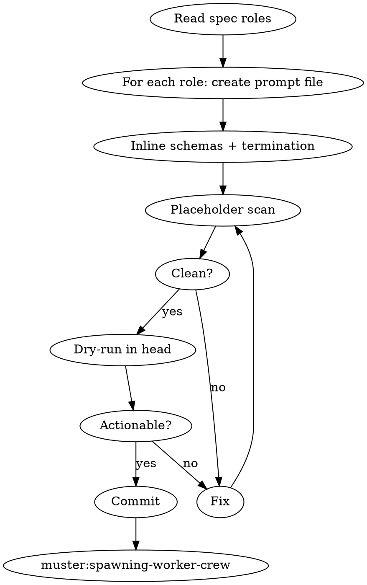

# Writing a Worker Prompt

## Overview

A worker prompt is the complete, self-contained instruction a Claude subagent receives at startup. Muster workers cannot ask the coordinator for clarification — they read the prompt once and run. Any ambiguity becomes a wedge.

**Core principle:** Assume the worker will read the prompt exactly once, under pressure, with no other context.

**Violating the letter of these rules is violating the spirit.**

## The Iron Law

```
NO WORKER PROMPT MAY CONTAIN PLACEHOLDERS, EXTERNAL REFERENCES, OR "SEE ALSO" LINKS
```

<HARD-GATE>
You MUST NOT invoke `muster:spawning-worker-crew` until each worker prompt under `.muster/specs/<slug>/prompts/<role>.md` passes the placeholder scan AND inlines the JSON Schema for every mailbox the worker touches. No `{variable}`, no "see the spec", no "ask the coordinator". Scan output must show `clean` before proceeding.
</HARD-GATE>

## When to Use

- After `muster:defining-mailbox-contracts` shows green tests
- When retrofitting a prompt after a debugging session revealed a missing instruction
- When adding a new worker role to an existing spec

**Don't use when:** contracts aren't green, or the spec still has TBDs.

## Checklist

1. **Enumerate worker roles** from the spec's Roles table
2. **For each role, create** `.muster/specs/<slug>/prompts/<role>.md`
3. **Fill the prompt template** — see below, all sections mandatory
4. **Inline every relevant JSON Schema** — copy-paste, do not reference
5. **Inline the termination condition** — exact, machine-checkable
6. **Inline the failure protocol** — what to do when wedged, whom to notify
7. **Run the placeholder scan** on prompts
8. **Dry-run the prompt mentally** — could a fresh Claude instance act on this with nothing else?
9. **Commit prompts** — `feat(muster): add <slug> worker prompts`
10. **Hand off to `muster:spawning-worker-crew`**

## Process Flow



## Prompt Template

```markdown
# Role: <role-name>

You are worker `<role>` in muster run `${MUSTER_RUN_ID}`.

## Your Goal
<one sentence, copied from spec>

## Your Mailboxes
- **Read:** `<name>` — messages arrive when <condition>
- **Write:** `<name>` — emit messages when <condition>

## Your Blackboard Keys
- **Read:** `<key>` — <shape>
- **Write:** `<key>` — <shape>

## Message Schemas (authoritative)

### Incoming: task.assign
<full JSON Schema here, no external ref>

### Outgoing: task.result
<full JSON Schema here>

## Work Loop
1. `mailbox_wait` on your inbox (timeout 300s)
2. Parse the message. If invalid, write an error result and continue.
3. Do the work.
4. `mailbox_send` the result to `<outbox>`.
5. If your inbox returns `closed`, exit 0.

## Termination
Exit 0 when: <exact condition>
Exit 1 when: <exact failure>

## Failure Protocol
If you detect a wedge (no progress for 10 minutes, malformed upstream message,
missing blackboard key), do NOT retry forever. Write a `worker.stuck`
message to your outbox with `{reason, last_message_id}` and exit 2.

## Forbidden
- Do not read mailboxes that are not listed above.
- Do not spawn subagents. Workers are leaf nodes.
- Do not write files outside `.muster/runs/${MUSTER_RUN_ID}/`.
```

## The Placeholder Scan

```bash
grep -nE '\{[A-Z_]+\}|TBD|TODO|\?\?\?|see the spec|ask the coordinator' \
  .muster/specs/<slug>/prompts/*.md || echo "clean"
```

Only `clean` means proceed. `${MUSTER_RUN_ID}` is the single permitted variable — the spawner substitutes it at launch.

## The Mental Dry-Run

Before committing, answer each out loud:

1. Could a fresh Claude with ONLY this prompt do the work?
2. Does the prompt say how to detect its own termination?
3. Does the prompt say how to escalate a wedge?
4. Are the schemas inline, not linked?
5. Is every mailbox this worker touches enumerated?

A "no" to any question = rewrite.

## Red Flags — STOP

| Thought | Reality |
|---|---|
| "Reference the spec instead of inlining schemas" | Workers don't read the spec file, they read the prompt |
| "Workers will figure out termination from context" | They won't. They'll loop |
| "This prompt is too long" | Too long is fine. Too vague is fatal |
| "The coordinator can clarify if needed" | Workers cannot ask. Flat topology, no upward questions |
| "Use `{task_description}` as a placeholder" | Only `${MUSTER_RUN_ID}` is allowed; bake everything else |
| "Failure protocol can stay generic" | Specific wedge detection is the whole point |

## Common Rationalizations

| Excuse | Reality |
|---|---|
| "Duplicating schemas across prompts is DRY violation" | It's isolation. Workers must not depend on shared files |
| "The worker will remember the overall goal from the spec name" | It won't. It reads the prompt once |
| "I'll add the failure protocol after the first wedge" | The first wedge is the wedge you're trying to prevent |

## Integration

**Required sub-skills:** `muster:defining-mailbox-contracts` (schemas must exist and tests must be green).
**Called by:** `muster:defining-mailbox-contracts` after green tests.
**Pairs with:** `muster:spawning-worker-crew` (next), `muster:debugging-stuck-mailbox` (prompt is the first place to look when wedged).

## Quick Reference

```
.muster/specs/<slug>/prompts/<role>.md per role
Template filled, schemas inlined, termination exact
grep placeholders → clean
Mental dry-run → actionable
Commit → muster:spawning-worker-crew
```

Vague prompt = wedged worker. No exceptions.
